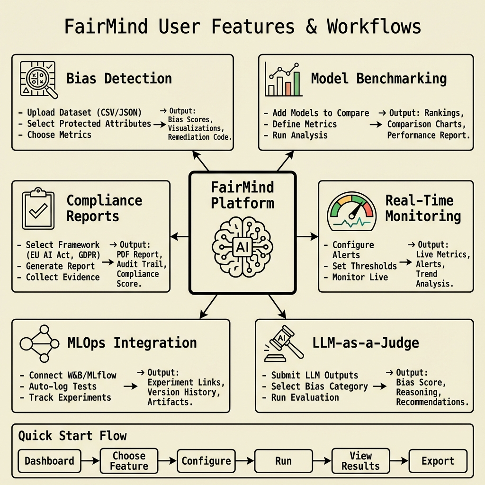
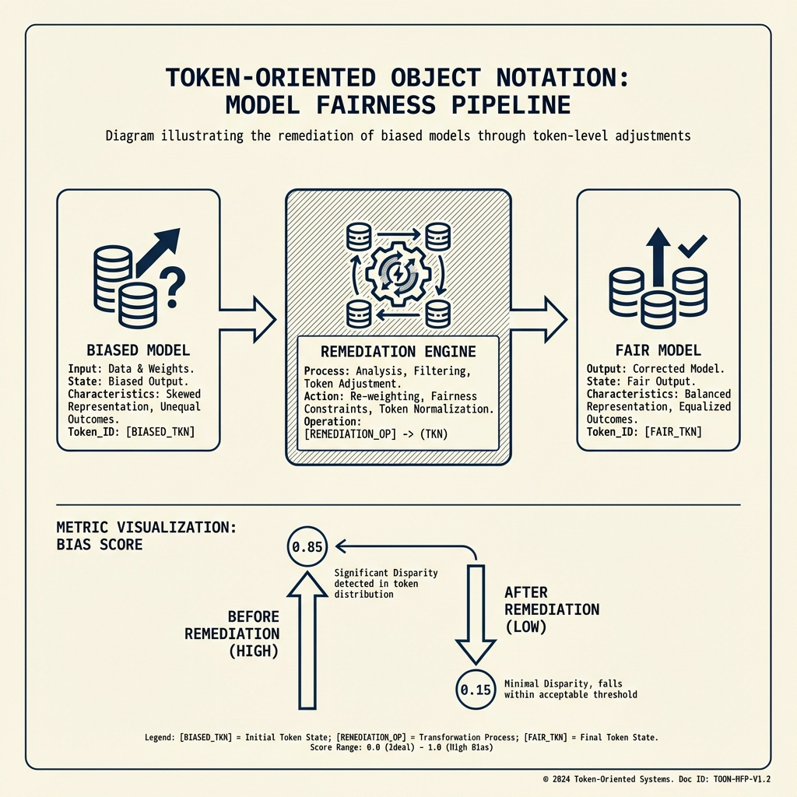
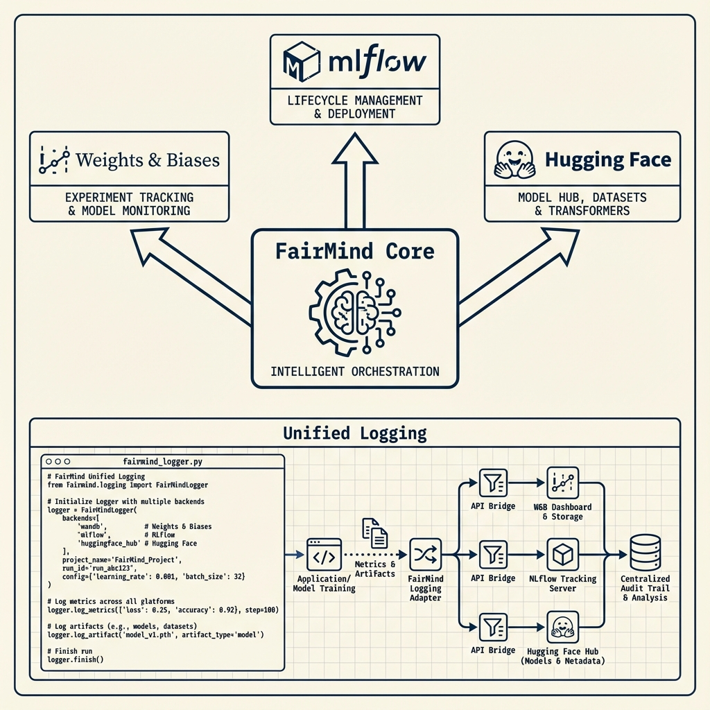
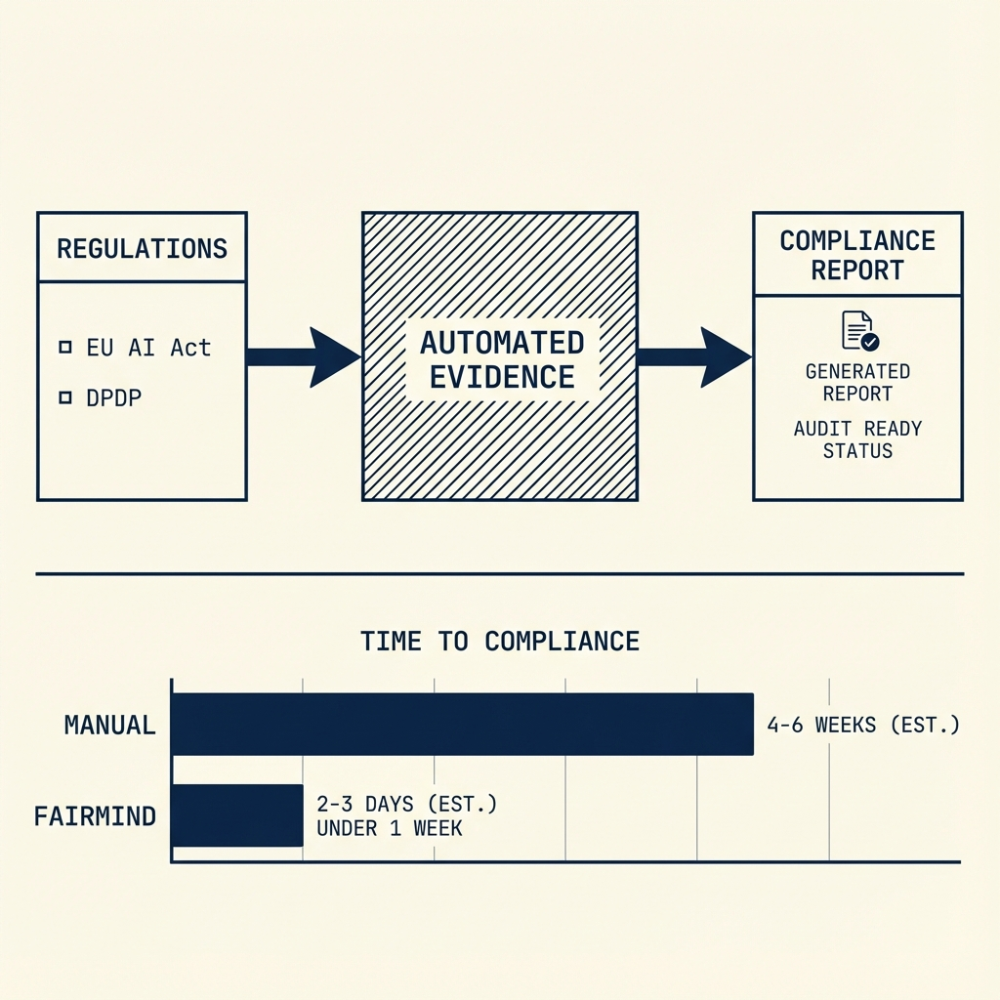
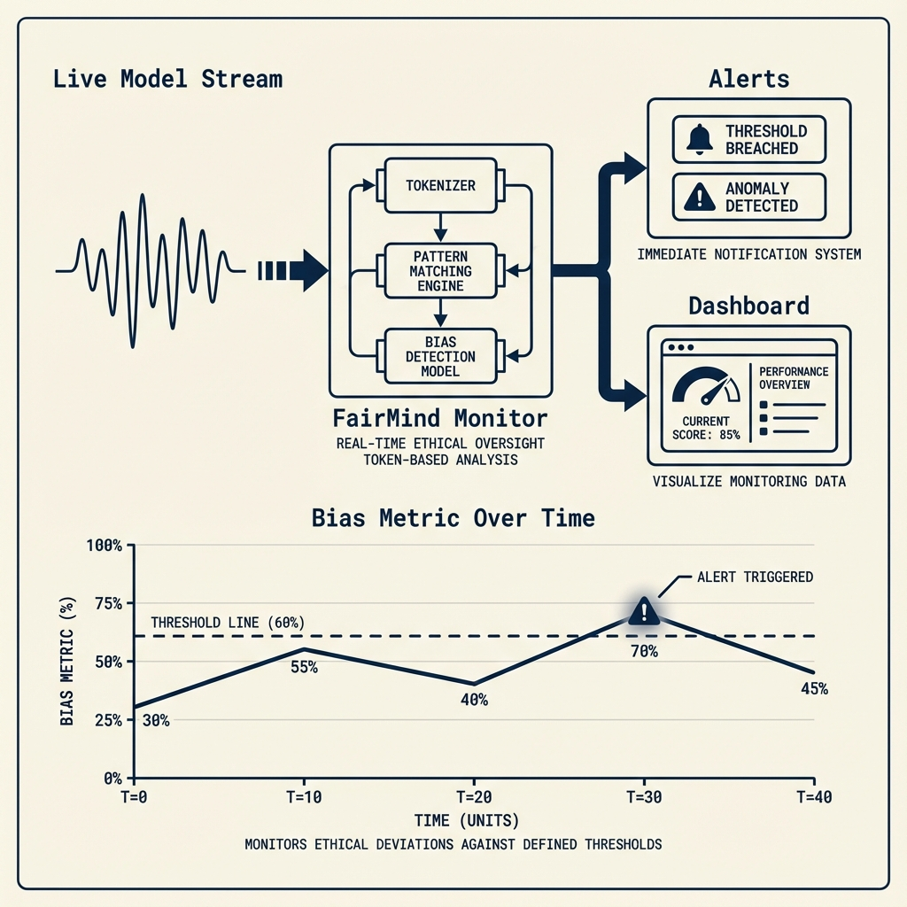
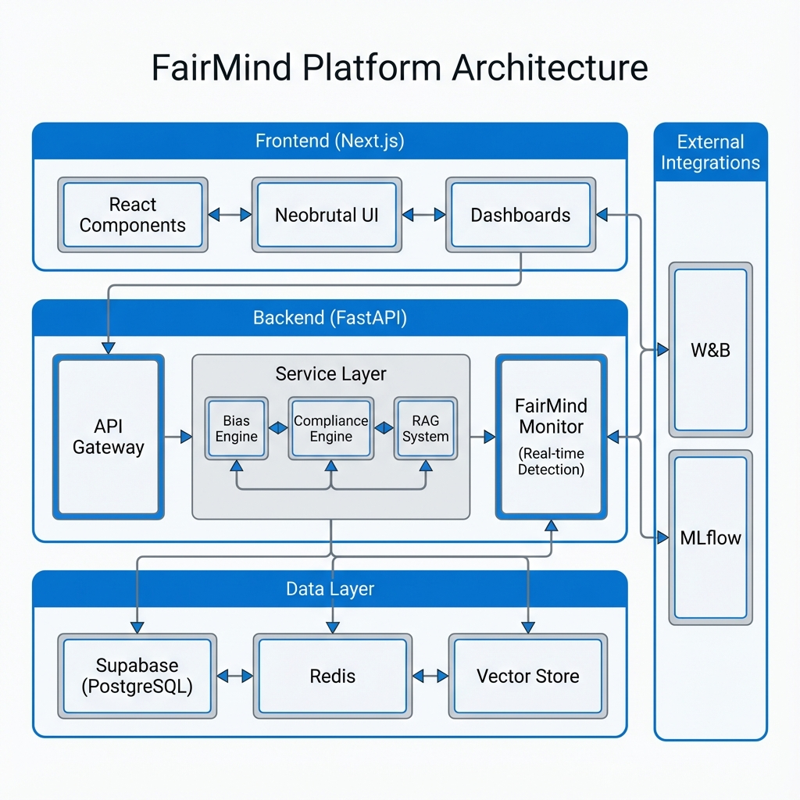

<div align="center">
  
</div>

<br>

<div align="center">

**Ethical AI Governance and Bias Detection Platform**

</div>

[](https://api.fairmind.xyz)
[](https://app-demo.fairmind.xyz)
[](./FINAL_TESTING_SUMMARY.md)
[](https://github.com/adhit-r/fairmind/graphs/contributors)
[](https://github.com/adhit-r/fairmind/issues?q=is%3Aissue+is%3Aopen+label%3A%22good+first+issue%22)
[](LICENSE)
[](CONTRIBUTING.md)

---

## Table of Contents

- [Overview](#overview)
- [Key Features](#key-features)
- [Architecture](#architecture)
- [Getting Started](#getting-started)
- [API Documentation](#api-documentation)
- [Frontend Features](#frontend-features)
- [Technology Stack](#technology-stack)
- [Project Structure](#project-structure)
- [Development](#development)
- [Deployment](#deployment)
- [Contributing](#contributing)
- [Security](#security)
- [License](#license)

---

## Overview

FairMind is a production-ready AI Governance and Bias Detection Platform designed for modern AI systems. It provides comprehensive tools for detecting bias, generating compliance reports, and ensuring ethical AI development across Classic Machine Learning, Large Language Models (LLMs), and Multimodal systems.

### What FairMind Does

FairMind helps organizations:
- Detect bias in AI models across multiple domains (Classic ML, LLMs, Multimodal)
- Automatically generate remediation code to fix detected biases
- Generate compliance reports for GDPR, EU AI Act, and other regulations
- Create AI Bill of Materials (BOM) for model transparency
- Integrate with MLOps tools (Weights & Biases, MLflow) for experiment tracking
- Monitor model performance and bias metrics in real-time
- Manage model lifecycle and governance

### Live Services

- **Backend API**: [api.fairmind.xyz](https://api.fairmind.xyz)
- **API Documentation**: [api.fairmind.xyz/docs](https://api.fairmind.xyz/docs)
- **Frontend Application**: [app-demo.fairmind.xyz](https://app-demo.fairmind.xyz)

---

## What Can Users Do?

<div align="center">
  
</div>

### Feature Status Summary

** Production Ready**: Bias Detection • Model Benchmarking • Compliance Reports • Real-Time Monitoring • MLOps Integration • Automated Remediation • Model Marketplace • Advanced Reporting • User Authentication (Local)

**🟡 Backend Complete, UI Pending**: LLM-as-a-Judge

**⏳ Planned Q2 2025**: Advanced Analytics Dashboard • Enterprise Features (RBAC, Teams) • Internationalization

** Out of Scope**: Mobile/Desktop Apps

---

## Key Features

### 1. Comprehensive Bias Detection

**Classic Machine Learning Bias Detection**
- Demographic Parity: Measures equal positive prediction rates across groups
- Equalized Odds: Ensures equal true positive and false positive rates
- Disparate Impact Analysis: Statistical parity difference calculation
- Individual Fairness: Counterfactual fairness testing
- Group Fairness: Multiple protected attribute analysis

**Large Language Model (LLM) Bias Detection**
- WEAT (Word Embedding Association Test): Detects implicit bias in word embeddings
- SEAT (Sentence Embedding Association Test): Tests bias in sentence-level embeddings
- Minimal Pairs Testing: Systematic bias detection through controlled comparisons
- Counterfactual Fairness: Tests model behavior under counterfactual scenarios
- Stereotype Detection: Identifies stereotypical associations in model outputs

**Multimodal Bias Detection**
- Image Generation Bias: Analyzes bias in image generation models (DALL-E, Stable Diffusion, etc.)
- Audio Generation Fairness: Tests bias in audio synthesis models
- Video Content Bias: Detects bias in video generation and analysis
- Cross-Modal Stereotype Analysis: Identifies bias across different modalities
- Representation Bias: Analyzes demographic representation in generated content

### 2. Automated Remediation

FairMind generates production-ready Python code to fix detected biases:

<div align="center">
  
</div>


- **Reweighting Strategies**: Adjusts sample weights to balance protected groups
- **Resampling Techniques**: Oversampling/undersampling to address class imbalance
- **Threshold Optimization**: Finds optimal decision thresholds for fairness
- **Model Retraining Pipelines**: Complete retraining workflows with fairness constraints
- **Post-Processing Methods**: Calibration and adjustment techniques
- **Pre-Processing Solutions**: Data transformation and cleaning strategies

### 3. MLOps Integration

Seamless integration with experiment tracking platforms:

<div align="center">
  
</div>


- **Weights & Biases Integration**
  - Automatic logging of bias test results
  - Deep linking from FairMind results to W&B dashboards
  - Experiment tracking and comparison
  - Model versioning and registry

- **MLflow Integration**
  - Experiment tracking and model registry
  - Artifact storage and management
  - Model serving and deployment tracking
  - Performance metrics logging

- **Zero-Configuration Setup**: Enable via environment variables
- **Automatic Logging**: All bias tests automatically logged to configured platforms
- **Dashboard Links**: Direct links from results to experiment dashboards

### 4. Compliance and Governance

**AI Bill of Materials (BOM)**
- Standard SBOM format for AI models
- Component tracking and provenance
- Dependency analysis and vulnerability scanning
- Model lineage and version history
- Training data documentation

**Regulatory Compliance**

<div align="center">
  
</div>

- **EU AI Act Assessment**: Automated compliance checking against EU AI Act requirements
- **GDPR Compliance**: Data protection and privacy compliance reporting
- **DPDP Act (India)**: Digital Personal Data Protection Act compliance
- **India AI Framework**: NITI Aayog Responsible AI Guidelines compliance
- **ISO/IEC 42001**: AI Management System Standard compliance
- **NIST AI RMF**: Risk Management Framework alignment
- **IEEE 7000**: Ethical concerns process compliance

**Risk Assessment**
- Automated risk categorization (High/Medium/Low)
- Policy-based risk evaluation
- Compliance gap analysis
- Remediation recommendations

**Evidence Collection**
- Comprehensive audit trail generation
- Compliance documentation export
- Regulatory mapping and reporting
- Stakeholder communication materials

### 5. Model Registry and Lifecycle Management

- Model registration and versioning
- Metadata management
- Performance tracking
- Bias history and trends
- Model comparison and benchmarking
- Lifecycle state management

### 6. Real-Time Monitoring

<div align="center">
  
</div>


- Live bias metrics monitoring
- Performance tracking
- Alert system for threshold violations
- Dashboard analytics
- Historical trend analysis

### 7. Model Marketplace

- **Discovery Hub**: Centralized platform for finding fair and verified models
- **Bias Cards**: Transparent fairness metrics for every model
- **Community Reviews**: User ratings and feedback system
- **Usage Tracking**: Monitor model adoption and performance

### 8. Advanced Reporting

- **PDF Generation**: Create professional, audit-ready reports
- **Bias Audits**: Detailed breakdown of fairness metrics and remediation steps
- **Compliance Certificates**: Proof of adherence to regulatory frameworks (EU AI Act, etc.)
- **Model Cards**: Standardized documentation for model transparency

---

## Architecture

### System Architecture

<div align="center">
  
</div>

### Component Breakdown

**Backend Services (40+ API Route Modules)**
- **Core Governance**: Authentication, Authorization, Policy Management
- **Bias Detection Engine**:
  - Classic ML (Demographic Parity, Equalized Odds)
  - Modern LLM (WEAT, SEAT, Minimal Pairs)
  - Multimodal (Image, Audio, Video)
- **Compliance Engine**:
  - **India Stack**: DPDP Act 2023, NITI Aayog Framework, Digital India Act
  - **Global**: EU AI Act, GDPR, NIST AI RMF
  - **RAG System**: Semantic search for regulatory documents
- **FairMind Monitor**:
  - Real-time token analysis
  - Live bias metric tracking
  - Threshold-based alerting
- **Automated Remediation**: Code generation for bias mitigation
- **MLOps Integration**: Seamless connection with W&B and MLflow

**Frontend Application (40+ Pages, 80+ Components)**
- **Dashboards**: Main, Compliance, Real-time Monitoring
- **Interactive Tools**: Bias Testing, Remediation Generator, Policy Editor
- **Visualizations**: Real-time charts, Bias metric heatmaps, Compliance scorecards
- **Evidence Management**: Automated collection and reporting UI

**Data Layer (Hybrid Architecture)**
- **SQLite (Local)**: Primary relational storage for users, authentication, and application state. Zero-config, local-first.
- **DuckDB (Analytics)**: High-performance in-process OLAP database for dataset analysis and heavy bias queries.
- **Supabase PostgreSQL (Optional/Prod)**: Scalable production database option.
- **Redis**: High-performance caching for real-time metrics.
- **Vector Store**: Embeddings for regulatory RAG system.
- **File Storage**: Local filesystem or S3 for artifacts and datasets.

---

## Getting Started

### Prerequisites

- **Python 3.9+** (Backend)
- **Node.js 18+** (Frontend)
- **UV** (Python package manager) - [Installation Guide](https://github.com/astral-sh/uv)
- **Bun** (JavaScript runtime) - [Installation Guide](https://bun.sh/)

### Quick Installation

```bash
# Clone the repository
git clone https://github.com/adhit-r/fairmind.git
cd fairmind

# Backend Setup
cd apps/backend
uv sync
cp config/env.example .env  # Configure your environment
# Create developer account (dev@fairmind.ai / dev)
uv run python scripts/create_dev_user.py
# Start server
uv run python -m uvicorn api.main:app --reload --port 8000

# Frontend Setup (New Terminal)
cd ../frontend-new
bun install
bun run dev
```

**Access Points:**
- Frontend: http://localhost:1111
- Backend API: http://localhost:8000
- API Documentation: http://localhost:8000/docs

### Environment Configuration

**Backend** (`apps/backend/.env`):
```env
# Database (Defaults to local SQLite if not set)
# DATABASE_URL=sqlite:///./fairmind.db

# Cache (Optional)
# REDIS_URL=redis://localhost:6379

# MLOps Integration (Optional)
WANDB_API_KEY=your_wandb_key
MLFLOW_TRACKING_URI=http://localhost:5000

# Security
SECRET_KEY=your-secret-key
JWT_SECRET=your-jwt-secret
JWT_ALGORITHM=HS256

# Environment
ENVIRONMENT=development
```

**Frontend** (`apps/frontend-new/.env.local`):
```env
NEXT_PUBLIC_API_URL=http://localhost:8000
```

### Detailed Setup

For comprehensive setup instructions, see:
- [Setup Guide](SETUP.md) - Complete installation and configuration
- [Quick Start Guide](QUICK_START.md) - 5-minute setup
- [Model Registration Guide](docs/MODEL_REGISTRATION_GUIDE.md) - Register and manage models
- [India Compliance Guide](INDIA_COMPLIANCE_GUIDE.md) - DPDP Act and India AI Framework compliance

---

## API Documentation

### Interactive Documentation

Full interactive API documentation with request/response examples:
- **Swagger UI**: [api.fairmind.xyz/docs](https://api.fairmind.xyz/docs)
- **ReDoc**: [api.fairmind.xyz/redoc](https://api.fairmind.xyz/redoc)

### Core API Endpoints

**Bias Detection**
- `POST /api/v1/bias/detect` - Classic ML bias detection
- `POST /api/v1/bias-v2/detect` - Production-ready bias detection
- `POST /api/v1/modern-bias/detect` - LLM bias detection (WEAT, SEAT)
- `POST /api/v1/multimodal-bias/image-detection` - Image generation bias
- `POST /api/v1/multimodal-bias/audio-detection` - Audio generation bias
- `POST /api/v1/multimodal-bias/video-detection` - Video content bias

**Remediation**
- `POST /api/v1/bias/remediate` - Generate remediation code
- `GET /api/v1/bias/remediation-strategies` - List available strategies

**MLOps Integration**
- `GET /api/v1/mlops/status` - Check integration status
- `POST /api/v1/mlops/log-test` - Manually log experiments
- `GET /api/v1/mlops/experiments` - List logged experiments

**Compliance and Governance**
- `POST /api/v1/compliance/report` - Generate compliance report
- `POST /api/v1/aibom/generate` - Create AI Bill of Materials
- `GET /api/v1/compliance/frameworks` - List supported frameworks

**Model Management**
- `GET /api/v1/core/models` - List registered models
- `POST /api/v1/core/models` - Register new model
- `GET /api/v1/core/models/{id}` - Get model details
- `PUT /api/v1/core/models/{id}` - Update model
- `DELETE /api/v1/core/models/{id}` - Delete model

**Monitoring and Analytics**
- `GET /api/v1/database/dashboard-stats` - Dashboard statistics
- `GET /api/v1/monitoring/metrics` - Real-time metrics
- `GET /api/v1/analytics/trends` - Historical trends

**System**
- `GET /health` - Health check endpoint
- `GET /api/v1/system/info` - System information

**Total API Endpoints**: 50+

For complete API reference, see [API Documentation](docs/API_ENDPOINTS.md)

---

## Frontend Features

### Dashboard Pages

| Page | Route | Description |
|------|-------|-------------|
| **Dashboard** | `/dashboard` | System overview, health metrics, recent activity |
| **Bias Detection** | `/bias` | Upload datasets, configure tests, view classic ML bias metrics |
| **Modern Bias** | `/modern-bias` | LLM bias detection interface (WEAT, SEAT, Minimal Pairs) |
| **Multimodal Bias** | `/multimodal-bias` | Image, audio, video bias analysis |
| **Test Results** | `/tests/[id]` | Detailed test analysis, W&B/MLflow links, JSON export |
| **Remediation** | `/remediation` | Select strategies, generate Python code |
| **Compliance Dashboard** | `/compliance-dashboard` | Policy management, report generation |
| **AI BOM** | `/ai-bom` | Bill of Materials generation and tracking |
| **Models** | `/models` | Model registry, versioning, lifecycle management |
| **Monitoring** | `/monitoring` | Real-time metrics, alerts, performance tracking |
| **Analytics** | `/analytics` | Performance analytics, trend analysis, insights |
| **Settings** | `/settings` | MLOps configuration, profile management, preferences |

### Key Frontend Features

- **Neobrutal Design System**: Modern, bold UI design
- **Responsive Layouts**: Works on desktop, tablet, and mobile
- **Real-Time Updates**: Live metrics and status updates
- **Interactive Visualizations**: Charts and graphs for bias metrics
- **Export Capabilities**: JSON, CSV, PDF export options
- **Deep Linking**: Direct links to MLOps dashboards
- **Dark Mode Support**: Theme customization
- **Accessibility**: WCAG compliance (in progress)

---

## Technology Stack

### Backend

**Core Framework**
- Python 3.9+
- FastAPI 0.121.1
- Uvicorn (ASGI server)
- Pydantic (data validation)

**Machine Learning**
- scikit-learn 1.7.2
- pandas 2.3.3
- numpy 2.3.4
- scipy 1.16.3
- transformers (HuggingFace)

**Database & Storage**
- SQLAlchemy 2.0.44 (ORM)
- Supabase (PostgreSQL production)
- SQLite (local development)
- Redis 7.0.1 (caching)

**Authentication & Security**
- JWT (JSON Web Tokens)
- bcrypt (password hashing)
- Security headers middleware
- Rate limiting

**Integrations**
- Supabase SDK
- Weights & Biases API
- MLflow tracking
- AWS S3 (boto3)

**Testing**
- pytest with coverage
- Playwright (E2E)
- Test coverage: 80%+ target

### Frontend

**Core Framework**
- Next.js 14.2.32
- React 18.3.1
- TypeScript 5.5.3

**UI Libraries**
- Radix UI (15+ components)
- Shadcn UI
- Neobrutalism design system
- Tailwind CSS 3.4.4

**State & Data**
- React Hooks
- React Hook Form 7.51.0
- Zod 3.23.8 (validation)

**Visualization**
- Recharts 2.12.0
- Tabler Icons
- Lucide React

**Testing**
- Playwright 1.44.0
- E2E test suite (11 test files)

**Build Tools**
- Bun (package manager)
- PostCSS
- Autoprefixer

### DevOps & Infrastructure

**Deployment**
- Netlify (frontend hosting)
- Docker support
- Kubernetes configs

**CI/CD**
- GitHub Actions
- Automated testing
- Branch protection enabled
- Security scanning (CodeQL, Dependabot)

**Monitoring**
- Health check endpoints
- Structured logging
- Error tracking (Sentry)

---

## Project Structure

```
fairmind/
├── apps/
│   ├── backend/              # FastAPI backend
│   │   ├── api/              # API routes (27 modules)
│   │   │   ├── routes/        # Route handlers
│   │   │   └── main.py       # FastAPI application
│   │   ├── services/         # Business logic (17 modules)
│   │   ├── config/           # Configuration
│   │   ├── middleware/       # Security & request handling
│   │   ├── database/         # Database models and migrations
│   │   ├── tests/            # Test suite (21 files)
│   │   └── pyproject.toml    # Python dependencies
│   │
│   ├── frontend-new/         # Next.js frontend
│   │   ├── src/
│   │   │   ├── app/          # Next.js app router (30+ pages)
│   │   │   ├── components/   # React components (60+)
│   │   │   └── lib/          # Utilities & API clients
│   │   ├── tests/            # E2E tests (Playwright)
│   │   └── package.json      # Node dependencies
│   │
│   ├── website/              # Marketing site (Astro)
│   └── ml/                    # ML utilities and experiments
│
├── docs/                      # Documentation
│   ├── development/           # Development guides
│   ├── deployment/            # Deployment guides
│   ├── architecture/          # Architecture documentation
│   └── API_ENDPOINTS.md       # API reference
│
├── scripts/                   # Utility scripts
├── k8s/                       # Kubernetes configurations
└── archive/                    # Archived files and documentation
```

---

## Development

### Running Locally

**Backend Development**
```bash
cd apps/backend
uv sync
uv run python -m uvicorn api.main:app --reload --port 8000
```

**Frontend Development**
```bash
cd apps/frontend-new
bun install
bun run dev
```

### Running Tests

**Backend Tests**
```bash
cd apps/backend
uv run pytest
uv run pytest --cov=api --cov-report=html
```

**Frontend E2E Tests**
```bash
cd apps/frontend-new
bun run test
bun run test:ui
```

**Backend E2E Tests**
```bash
cd apps/backend
uv run pytest tests/e2e/ -m e2e
```

### Code Quality

- **Linting**: Black, isort, flake8 (Python), ESLint (TypeScript)
- **Type Checking**: mypy (Python), TypeScript compiler
- **Formatting**: Black (Python), Prettier (TypeScript)
- **Pre-commit Hooks**: Automated code quality checks

### Development Guidelines

See [Contributing Guide](docs/CONTRIBUTING.md) for:
- Code style guidelines
- Commit message conventions
- Pull request process
- Testing requirements

---

## Deployment

### Production Deployment

**Backend**
- Deployment instructions pending


**Frontend (Netlify)**
- Automatic deployments from main branch
- Build command: `bun run build`
- Environment variables in Netlify dashboard
- CDN distribution

### Docker Deployment

```bash
# Build backend image
cd apps/backend
docker build -t fairmind-backend .

# Run backend
docker run -p 8000:8000 fairmind-backend

# Build frontend image
cd apps/frontend-new
docker build -t fairmind-frontend .

# Run frontend
docker run -p 3000:3000 fairmind-frontend
```

### Kubernetes Deployment

Kubernetes configurations available in `k8s/` directory:
- Backend deployment
- Frontend deployment
- ConfigMaps and Secrets
- Ingress configuration

See [Deployment Guide](docs/deployment/DEPLOYMENT_GUIDE_2025.md) for detailed instructions.

---

## Contributing

FairMind is an open-source project and welcomes contributions from the community.

### How to Contribute

1. **Fork the repository**
2. **Create a feature branch** (`git checkout -b feature/amazing-feature`)
3. **Make your changes** following our coding standards
4. **Write or update tests** as needed
5. **Commit your changes** using conventional commit format
6. **Push to your branch** (`git push origin feature/amazing-feature`)
7. **Open a Pull Request** targeting the `main` branch

### Contribution Guidelines

- Follow the code style guidelines in [CONTRIBUTING.md](docs/CONTRIBUTING.md)
- Write tests for new features
- Update documentation as needed
- Use conventional commit messages
- Ensure all tests pass before submitting

### Good First Issues

We have 21+ good first issues perfect for new contributors:
- [View Good First Issues](https://github.com/adhit-r/fairmind/issues?q=is%3Aissue+is%3Aopen+label%3A%22good+first+issue%22)

### Code Review Process

- All PRs require at least 1 review before merging
- Main branch is protected
- Automated tests must pass
- Code quality checks enforced

---

## Security

FairMind takes security seriously. We follow responsible disclosure practices.

### Reporting Vulnerabilities

- **Email**: security@fairmind.xyz
- **Response Time**: 24 hours
- **Please do not report security vulnerabilities through public GitHub issues**

### Security Tools

- CodeQL for vulnerability detection
- Dependabot for dependency scanning
- Regular security audits
- Automated security checks in CI/CD

### Security Features

- JWT-based authentication
- Password hashing with bcrypt
- Security headers middleware
- Rate limiting
- Input validation and sanitization
- SQL injection prevention
- XSS protection

See [Security Policy](docs/SECURITY.md) for complete security policy.

---

## Project Status

### Current Phase: Q1 2025 (Foundation)

**Completed**
- Core AI governance features
- Modern LLM bias detection (WEAT, SEAT, Minimal Pairs)
- Multimodal bias analysis (Image, Audio, Video)
- MLOps integration (W&B, MLflow)
- Compliance reporting (EU AI Act, GDPR)
- AI BOM generation
- Production deployment
- Comprehensive testing (80%+ coverage)
- Documentation suite

**In Progress**
- CI/CD pipeline automation
- Frontend performance optimizations
- Security vulnerability remediation
- Accessibility improvements

**Planned**
- Mobile responsiveness
- Internationalization (i18n)
- Advanced analytics dashboard
- Enterprise features

See [ROADMAP.md](ROADMAP.md) for detailed roadmap.

---

## License

This project is licensed under the MIT License - see the [LICENSE](LICENSE) file for details.

---

## Support & Community

**Resources**
- [Documentation](docs/)
- [GitHub Issues](https://github.com/adhit-r/fairmind/issues)
- [GitHub Discussions](https://github.com/adhit-r/fairmind/discussions)
- [Contributing Guide](docs/CONTRIBUTING.md)

**Contact**
- Repository: [github.com/adhit-r/fairmind](https://github.com/adhit-r/fairmind)
- support email : adhi.r@fairmind.xyz 
---

**FairMind - Making AI fair, transparent, and accountable for everyone.**

*Built for the AI ethics community*
