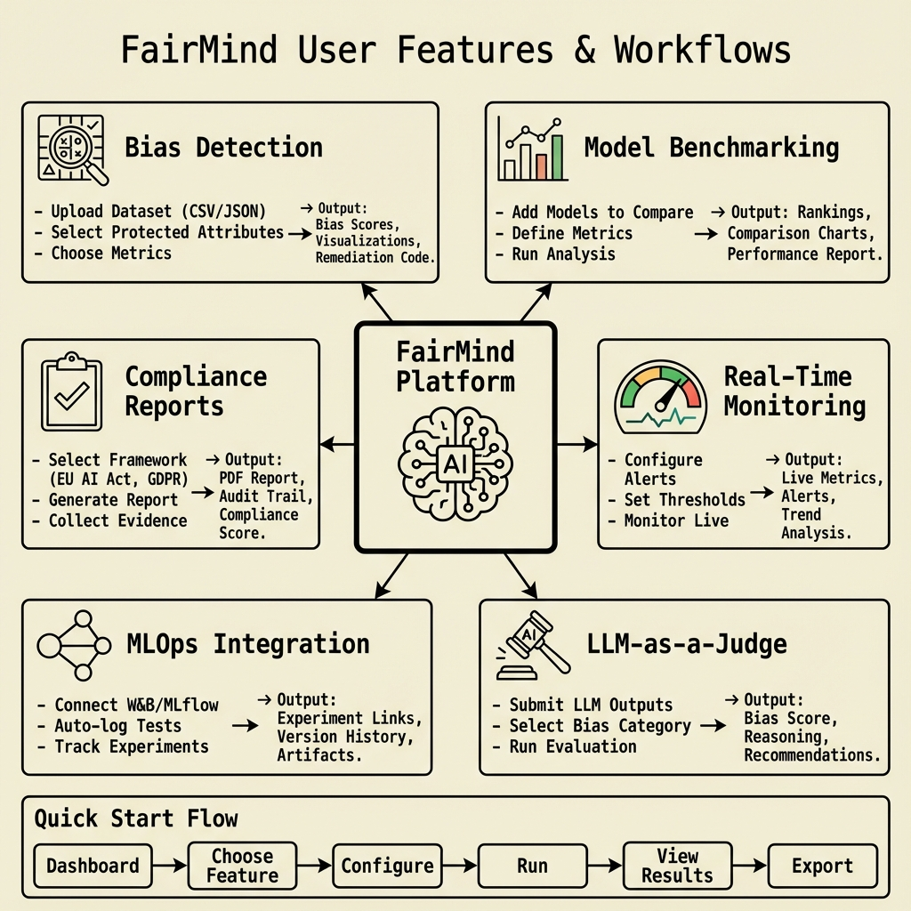
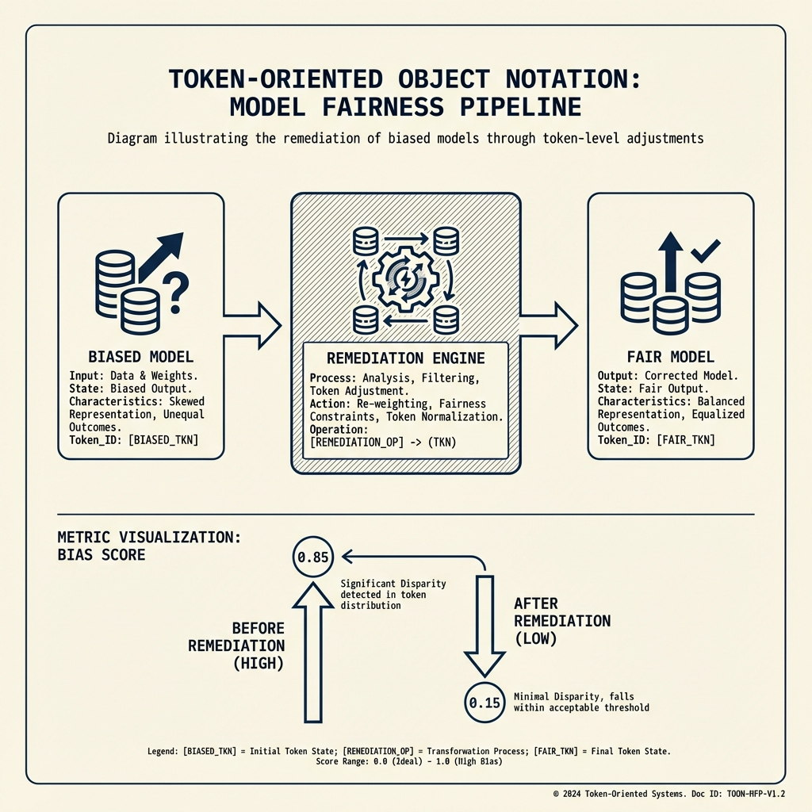
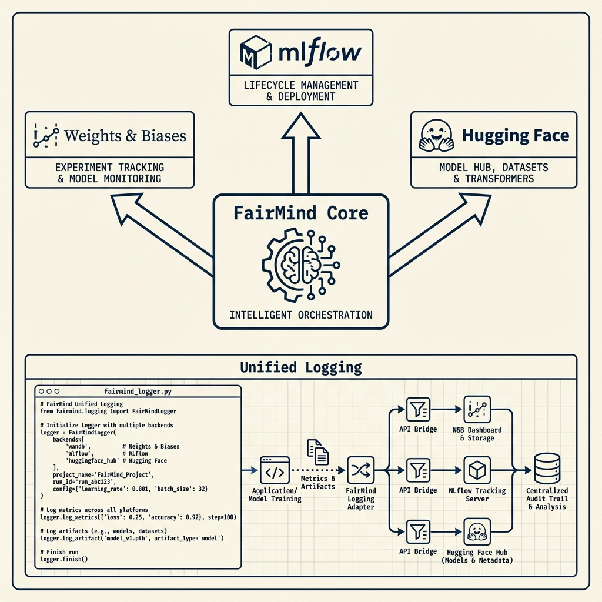
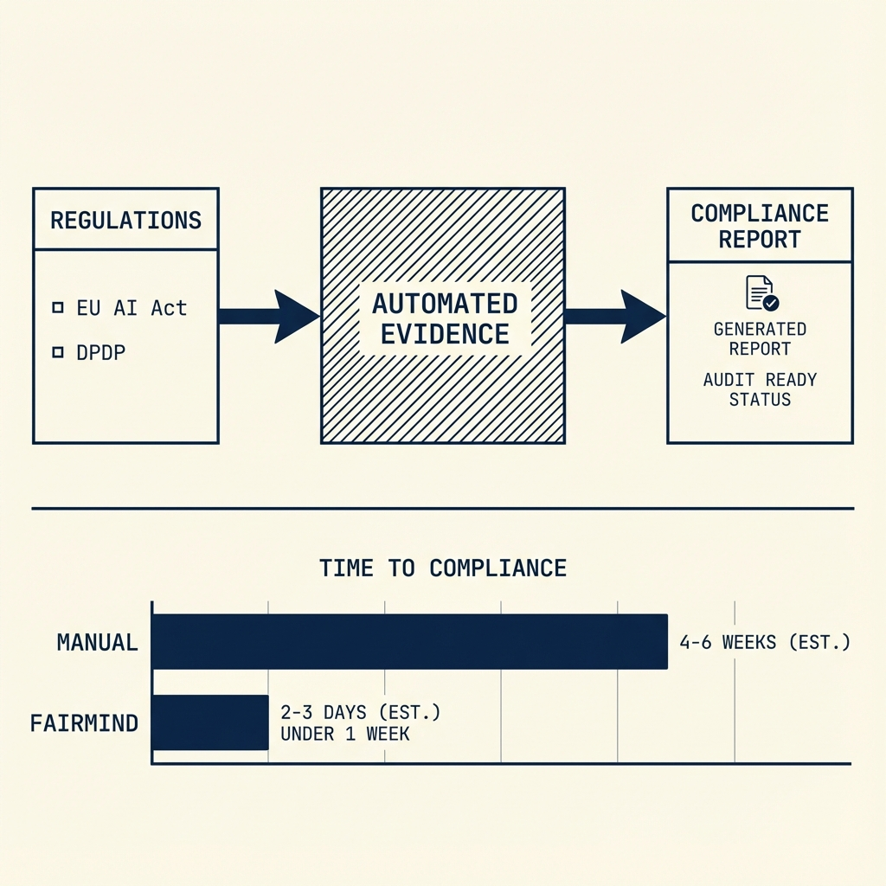
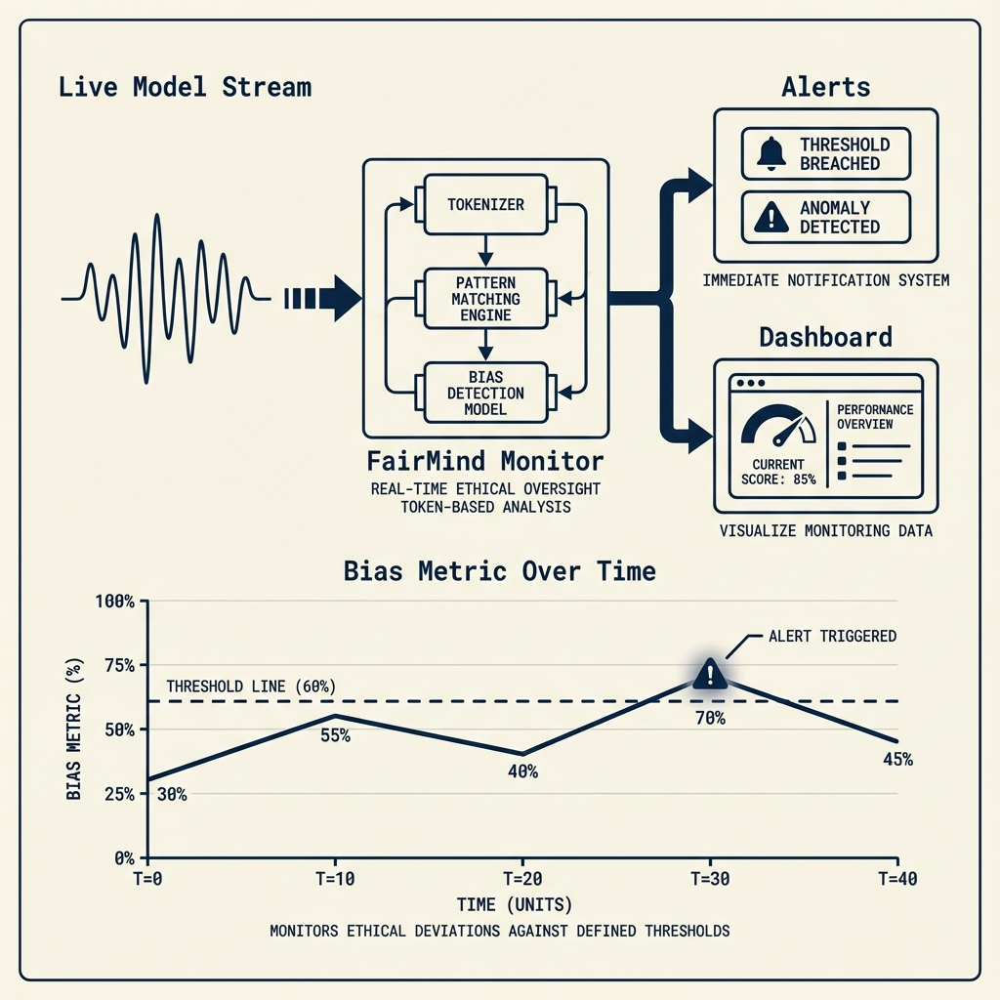
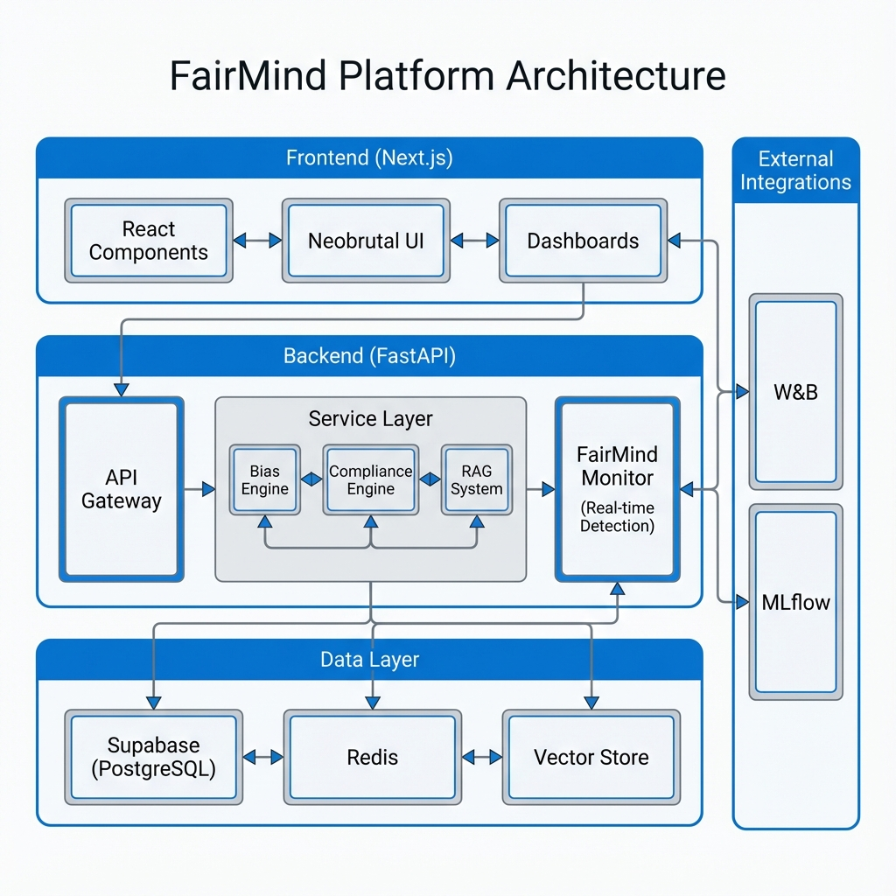

<div align="center">
  
</div>

<br>

<div align="center">

**AI assurance control plane for evidence-grade evaluation**
*Evidence-first foundations for governing models, LLMs, agents, and multimodal systems*

</div>

[](docs/superpowers/plans/2026-07-19-fairmind-2027-ai-assurance-todo.md)
[](apps/backend)
[](apps/frontend)
[](https://github.com/adhit-r/fairmind/graphs/contributors)
[](https://github.com/adhit-r/fairmind/issues?q=is%3Aissue+is%3Aopen+label%3A%22good+first+issue%22)
[](LICENSE)
[](CONTRIBUTING.md)

---

## Table of Contents

- [Overview](#overview)
- [Key Features](#key-features)
- [Architecture](#architecture)
- [Getting Started](#getting-started)
- [API Documentation](#api-documentation)
- [Frontend Features](#frontend-features)
- [Technology Stack](#technology-stack)
- [Project Structure](#project-structure)
- [Development](#development)
- [Deployment](#deployment)
- [Contributing](#contributing)
- [Security](#security)
- [License](#license)

---

## Overview

FairMind is evolving from a model-focused governance application into an evidence-grade AI assurance control plane. The 2027 objective is to make evaluation evidence reproducible, correctly scoped, reviewable, and useful across predictive models, LLMs, agents, code generation, image, audio, video, and multimodal systems.

The current branch is an **internal, default-off trust-foundation alpha**. It implements the evidence contract, trust/admission/review foundation, and PostgreSQL-authoritative operational freshness, but it is not yet a generally available evaluator, certification service, or automatic enforcement product.

### Current assurance boundary

| Capability | Current state | Claim allowed today |
|---|---|---|
| Target and suite identity | Implemented in the v2 contract | Immutable planning metadata |
| Execution envelope and Passport v2 binding | Implemented and tested | Evidence-integrity foundation |
| Signature, replay, scope, and admission checks | Implemented as a default-off kernel with a separately gated route boundary | Supporting evidence verification |
| Issuer, public Ed25519 key, and trust-policy administration | Implemented behind independent default-off gates with PostgreSQL-authoritative mutations | Internal trust-root administration only |
| Operational evidence freshness | Derived at database time from exact admission, receipt, evaluator, issuer, key, policy, review, expiry, and supersession bindings | Internal evidence-support status; not certification or compliance |
| Legacy contract v1 plans and runs | Preserved as readable historical records; v2 activation blocks legacy creation, activation, run preparation, and evidence linking | Clone into an exactly bound v2 plan before new execution |
| Environmental governance evidence | Canonical organization/system API and tenant-bound persistence verified locally on SQLite and PostgreSQL 14 | Scoped evidence workflow only; not validated emissions accounting or compliance proof |
| Admission, reviewer, and governance-decision workflow | Internal routes and PostgreSQL gates are implemented but remain default-off and are not a public execution capability | Internal alpha only; do not claim general availability |
| Sandboxed worker execution | Not yet shipped | Do not claim |
| LLM, agent, code, vision, image, audio, video, and multimodal packs | Not yet independently validated | Planned/experimental only |
| Pre-deployment, realtime, and post-deployment assurance | Not yet shipped | Do not claim |
| Compliance, certification, automatic approval, or automatic enforcement | Not provided by this branch | Do not claim |

See the [2027 assurance roadmap](docs/superpowers/plans/2026-07-19-fairmind-2027-ai-assurance-todo.md) for the release gates that must pass before individual execution capabilities are exposed.

### What FairMind Does

FairMind is being built to help organizations:

- Define immutable targets, suites, configurations, and lifecycle phases.
- Collect evaluator evidence with exact scope, provenance, freshness, and review state.
- Map accepted findings to governance controls and framework evidence.
- Run specialist evaluation engines in isolated workers when the execution layer is released.
- Produce reproducible audit packs from evidence hashes without asserting automatic compliance.

Existing legacy routes and services remain in the repository for compatibility. Their names or presence do not mean that a capability is currently validated or release-ready.

### Local development surfaces

- **Backend API**: `http://localhost:8000`
- **API Documentation**: `http://localhost:8000/docs`
- **Frontend Application**: `http://localhost:1111`

Hosted links, where available, are development or demonstration surfaces and are not evidence that every roadmap capability is deployed.

---

## What Can Users Do?

<div align="center">
  
</div>

### Feature Status Summary

**Implemented foundation**: target and suite identity, execution-envelope binding, Passport v2 verification primitives, trust-policy checks, replay protection, and evidence-state contracts.

**In progress**: enabling public evidence admission after evaluator registration, four-eyes review, frontend evidence states, worker isolation, and release-gate verification. The route remains disabled by default and its bootstrap catalog contains no admitted evaluators.

**Planned after the foundation**: real predictive, LLM, agent, code, vision, image, audio, video, and multimodal evaluation packs; pre-deployment and realtime pre/post workflows; and independently benchmarked execution claims.

**Not claimable from this branch**: compliance certification, automatic approval, automatic enforcement, or a generally available “FairMind Verified” designation.

---

## Key Features

The catalog below describes the product direction and compatibility surfaces. A feature is only an executable assurance capability when its versioned suite, runner, benchmark report, sandbox report, and release gate are complete.

### 1. Bias and safety evaluation lanes

**Predictive-model fairness (legacy kernels; independent validation required)**
- Demographic Parity: Measures equal positive prediction rates across groups
- Equalized Odds: Ensures equal true positive and false positive rates
- Disparate Impact Analysis: Statistical parity difference calculation
- Individual Fairness: Counterfactual fairness testing
- Group Fairness: Multiple protected attribute analysis

**LLM and text evaluation (planned; no production adapter on this branch)**
- WEAT (Word Embedding Association Test): Detects implicit bias in word embeddings
- SEAT (Sentence Embedding Association Test): Tests bias in sentence-level embeddings
- Minimal Pairs Testing: Systematic bias detection through controlled comparisons
- Counterfactual Fairness: Tests model behavior under counterfactual scenarios
- Stereotype Detection: Identifies stereotypical associations in model outputs

**Multimodal evaluation packs (planned; no production packs on this branch)**
- Image Generation Bias: Analyzes bias in image generation models (DALL-E, Stable Diffusion, etc.)
- Audio Generation Fairness: Tests bias in audio synthesis models
- Video Content Bias: Detects bias in video generation and analysis
- Cross-Modal Stereotype Analysis: Identifies bias across different modalities
- Representation Bias: Analyzes demographic representation in generated content

### 2. Remediation (legacy/experimental)

Some legacy routes generate example Python remediation code. Treat generated code as advisory and review it before use; this branch does not certify that generated code is safe or effective.

<div align="center">
  
</div>


- **Reweighting Strategies**: Adjusts sample weights to balance protected groups
- **Resampling Techniques**: Oversampling/undersampling to address class imbalance
- **Threshold Optimization**: Finds optimal decision thresholds for fairness
- **Model Retraining Pipelines**: Complete retraining workflows with fairness constraints
- **Post-Processing Methods**: Calibration and adjustment techniques
- **Pre-Processing Solutions**: Data transformation and cleaning strategies

### 3. MLOps integrations (compatibility surfaces)

Legacy integrations exist for experiment tracking platforms. Their presence does not provide evidence admission or certify an evaluation result:

<div align="center">
  
</div>


- **Weights & Biases Integration**
  - Optional logging of bias test results
  - Deep linking from FairMind results to W&B dashboards
  - Experiment tracking and comparison
  - Model versioning and registry

- **MLflow Integration**
  - Experiment tracking and model registry
  - Artifact storage and management
  - Model serving and deployment tracking
  - Performance metrics logging

- **Configuration**: Enable via environment variables where supported
- **Logging**: Results can be logged by supported legacy routes
- **Dashboard Links**: Direct links from results to experiment dashboards

### 4. Governance evidence and framework mapping

FairMind is intended to gather and organize evidence for governance frameworks. Framework mapping is not the same as legal compliance, certification, or an automatic conformity decision.

**AI Bill of Materials (BOM) — planned**
- The legacy global HTTP API is quarantined and the dashboard is intentionally unavailable.
- A replacement must enforce authenticated tenant scope, exact action permissions, server-derived identity, and audited persistence.
- Component provenance, dependency analysis, vulnerability metadata, lineage, and training-data documentation remain roadmap capabilities until independently validated.

**Regulatory Compliance**

<div align="center">
  
</div>

- **EU AI Act**: Planned evidence and control mapping
- **GDPR and DPDP Act (India)**: Planned privacy and governance evidence mapping
- **India AI Framework, ISO/IEC 42001, NIST AI RMF, and IEEE 7000**: Framework references and planned mappings

**Risk Assessment**
- Automated risk categorization (High/Medium/Low)
- Policy-based risk evaluation
- Compliance gap analysis
- Remediation recommendations

**Evidence Collection**
- Comprehensive audit trail generation
- Compliance documentation export
- Regulatory mapping and reporting
- Stakeholder communication materials

### 5. Model Registry and Lifecycle Management

- Model registration and versioning
- Metadata management
- Performance tracking
- Bias history and trends
- Model comparison and benchmarking
- Lifecycle state management

### 6. Monitoring and lifecycle assurance (planned)

<div align="center">
  
</div>


- Planned post-deployment metrics, drift and incident replay
- Planned advisory realtime pre/post checks
- Historical analysis where supported by a connected evaluator

### 7. Model registry and marketplace (legacy/planned)

- **Discovery Hub**: Centralized platform for model metadata
- **Bias Cards**: Intended to show evidence-backed metrics when validated evidence exists
- **Community Reviews**: User ratings and feedback system
- **Usage Tracking**: Monitor model adoption and performance

### 8. Reporting and audit packs (planned)

- **PDF Generation**: Create professional, audit-ready reports
- **Bias Audits**: Detailed breakdown of fairness metrics and remediation steps
- **Framework evidence packs**: Reproducible exports after evidence admission and reviewer acceptance; not compliance certificates
- **Model Cards**: Standardized documentation for model transparency

---

## Architecture

### System Architecture

<div align="center">
  
</div>

### Component Breakdown

**Backend services (legacy and active modules)**
- **Core Governance**: Authentication, Authorization, Policy Management
- **Assurance foundation**: Target and suite identity, execution envelopes, Passport v2 binding, trust checks, and evidence-state contracts
- **Legacy evaluation routes**: Unsupported LLM-judge, modern-bias, and multimodal execution endpoints are unmounted pending independently validated packs
- **Governance mapping surfaces**: Framework references and evidence organization; not automatic compliance decisions
- **MLOps integrations**: Optional compatibility adapters for W&B and MLflow

**Frontend application**
- Unsupported LLM-judge, LLM-testing, modern-bias, multimodal, and explainability pages render explicit inert availability states
- Evidence-admission, signer, freshness, review, and governance axes are being added to the product UI
- The original high-contrast neobrutalist visual language remains the design constraint

**Data Layer (Hybrid Architecture)**
- **SQLite (Local)**: Primary relational storage for users, authentication, and application state. Zero-config, local-first.
- **DuckDB (Analytics)**: High-performance in-process OLAP database for dataset analysis and heavy bias queries.
- **Supabase PostgreSQL (Optional/Prod)**: Scalable production database option.
- **Redis**: High-performance caching for real-time metrics.
- **Vector Store**: Embeddings for regulatory RAG system.
- **File Storage**: Local filesystem or S3 for artifacts and datasets.

---

## Getting Started

### Prerequisites

- **Python 3.9+** (Backend)
- **Node.js 18+** (Frontend)
- **UV** (Python package manager) - [Installation Guide](https://github.com/astral-sh/uv)
- **Bun** (JavaScript runtime) - [Installation Guide](https://bun.sh/)

### Quick Installation

```bash
# Clone the repository
git clone https://github.com/adhit-r/fairmind.git
cd fairmind

# Backend Setup
cd apps/backend
uv sync
cp config/env.example .env  # Configure your environment
# Create developer account (dev@fairmind.ai / dev)
uv run python scripts/create_dev_user.py
# Start server
uv run python -m uvicorn api.main:app --reload --port 8000

# Frontend Setup (New Terminal)
cd ../frontend
bun install
bun run dev
```

**Access Points:**
- Frontend: http://localhost:1111
- Backend API: http://localhost:8000
- API Documentation: http://localhost:8000/docs

### Environment Configuration

**Backend** (`apps/backend/.env`):
```env
# Database (Defaults to local SQLite if not set)
# DATABASE_URL=sqlite:///./fairmind.db

# Cache (Optional)
# REDIS_URL=redis://localhost:6379

# MLOps Integration (Optional)
WANDB_API_KEY=your_wandb_key
MLFLOW_TRACKING_URI=http://localhost:5000

# Security
SECRET_KEY=your-secret-key
JWT_SECRET=your-jwt-secret
JWT_ALGORITHM=HS256

# Environment
ENVIRONMENT=development
```

**Frontend** (`apps/frontend/.env.local`):
```env
NEXT_PUBLIC_API_URL=http://localhost:8000
```

### Detailed Setup

For comprehensive setup instructions, see:
- [Setup Guide](SETUP.md) - Complete installation and configuration
- [Quick Start Guide](QUICK_START.md) - 5-minute setup
- [Model Registration Guide](docs/MODEL_REGISTRATION_GUIDE.md) - Register and manage models
- [India Compliance Guide](INDIA_COMPLIANCE_GUIDE.md) - DPDP Act and India AI Framework compliance

---

## API Documentation

### Interactive Documentation

Full interactive API documentation with request/response examples:
- **Swagger UI**: [api.fairmind.xyz/docs](https://api.fairmind.xyz/docs)
- **ReDoc**: [api.fairmind.xyz/redoc](https://api.fairmind.xyz/redoc)

### Core API Endpoints

**Bias Detection**
- `POST /api/v1/bias/detect` - Classic ML bias detection
- `POST /api/v1/bias-v2/detect` - Production-ready bias detection
- LLM-judge, modern-bias, and multimodal execution families are intentionally unmounted until independently calibrated packs pass their release gates

**Remediation**
- `POST /api/v1/bias/remediate` - Generate remediation code
- `GET /api/v1/bias/remediation-strategies` - List available strategies

**MLOps Integration**
- `GET /api/v1/mlops/status` - Check integration status
- `POST /api/v1/mlops/log-test` - Manually log experiments
- `GET /api/v1/mlops/experiments` - List logged experiments

**Compliance and Governance**
- `POST /api/v1/compliance/report` - Generate compliance report
- `GET /api/v1/compliance/frameworks` - List supported frameworks

**Model Management**
- `GET /api/v1/core/models` - List registered models
- `POST /api/v1/core/models` - Register new model
- `GET /api/v1/core/models/{id}` - Get model details
- `PUT /api/v1/core/models/{id}` - Update model
- `DELETE /api/v1/core/models/{id}` - Delete model

**Monitoring and Analytics**
- `GET /api/v1/database/dashboard-stats` - Dashboard statistics
- `GET /api/v1/monitoring/metrics` - Real-time metrics
- `GET /api/v1/analytics/trends` - Historical trends

**System**
- `GET /health` - Health check endpoint
- `GET /api/v1/system/info` - System information

The API catalog includes legacy endpoints. Endpoint presence does not imply that the route is bound to the v2 evidence contract or independently validated. The legacy `/api/v1/ai-bom` HTTP surface and unsupported LLM-judge, modern-bias, and multimodal evaluator families are intentionally unmounted. They remain unavailable until their tenant, execution, calibration, evidence, and security gates are independently verified.

For complete API reference, see [API Documentation](docs/API_ENDPOINTS.md)

---

## Frontend Features

### Dashboard Pages

| Page | Route | Description |
|------|-------|-------------|
| **Dashboard** | `/dashboard` | System overview, health metrics, recent activity |
| **Bias Detection** | `/bias` | Upload datasets, configure tests, view classic ML bias metrics |
| **LLM Judge** | `/llm-judge` | Explicit unavailable state; evaluator pack pending calibration and release gates |
| **LLM Testing** | `/llm-testing` | Explicit unavailable state; no judge, red-team, or embedding evaluator is executed |
| **Explainability Studio** | `/explainability-studio` | Explicit unavailable state; no attribution or causal-analysis evaluator is executed |
| **Modern Bias** | `/modern-bias` | Explicit unavailable state; combined evaluator packs are not executed |
| **Multimodal Bias** | `/multimodal-bias` | Explicit unavailable state; image, audio, video, and cross-modal packs are not executed |
| **Test Results** | `/tests/[id]` | Detailed test analysis, W&B/MLflow links, JSON export |
| **Remediation** | `/remediation` | Select strategies, generate Python code |
| **Compliance Dashboard** | `/compliance-dashboard` | Policy management, report generation |
| **AI BOM** | `/ai-bom` | Explicit unavailable state; legacy read/write API quarantined pending tenant-safe replacement |
| **Models** | `/models` | Model registry, versioning, lifecycle management |
| **Monitoring** | `/monitoring` | Real-time metrics, alerts, performance tracking |
| **Analytics** | `/analytics` | Performance analytics, trend analysis, insights |
| **Settings** | `/settings` | MLOps configuration, profile management, preferences |

### Key Frontend Features

- **Neobrutal Design System**: Modern, bold UI design
- **Responsive Layouts**: Works on desktop, tablet, and mobile
- **Status updates**: Live updates where a connected service supports them
- **Interactive Visualizations**: Charts and graphs for bias metrics
- **Export Capabilities**: JSON, CSV, PDF export options
- **Deep Linking**: Direct links to MLOps dashboards
- **Dark Mode Support**: Theme customization
- **Accessibility**: WCAG compliance (in progress)

---

## Technology Stack

### Backend

**Core Framework**
- Python 3.9+
- FastAPI 0.121.1
- Uvicorn (ASGI server)
- Pydantic (data validation)

**Machine Learning**
- scikit-learn 1.7.2
- pandas 2.3.3
- numpy 2.3.4
- scipy 1.16.3
- transformers (HuggingFace)

**Database & Storage**
- SQLAlchemy 2.0.44 (ORM)
- Supabase (PostgreSQL production)
- SQLite (local development)
- Redis 7.0.1 (caching)

**Authentication & Security**
- JWT (JSON Web Tokens)
- bcrypt (password hashing)
- Security headers middleware
- Rate limiting

**Integrations**
- Supabase SDK
- Weights & Biases API
- MLflow tracking
- AWS S3 (boto3)

**Testing**
- pytest with coverage
- Playwright (E2E)
- Recorded trust-foundation baseline: 548 non-PostgreSQL tests and 73 native PostgreSQL tests
- Operational-freshness checkpoint: 212 focused application/API tests and 87 native migration/PostgreSQL tests; one environment-specific collation branch skipped
- Full-repository backend baseline: not yet green; see the release-gate backlog

### Frontend

**Core Framework**
- Next.js 14.2.32
- React 18.3.1
- TypeScript 5.5.3

**UI Libraries**
- Radix UI (15+ components)
- Shadcn UI
- Neobrutalism design system
- Tailwind CSS 3.4.4

**State & Data**
- React Hooks
- React Hook Form 7.51.0
- Zod 3.23.8 (validation)

**Visualization**
- Recharts 2.12.0
- Tabler Icons
- Lucide React

**Testing**
- Playwright 1.44.0
- E2E test suite (11 test files)

**Build Tools**
- Bun (package manager)
- PostCSS
- Autoprefixer

### DevOps & Infrastructure

**Deployment**
- Netlify (frontend hosting)
- Docker support
- Kubernetes configs

**CI/CD**
- GitHub Actions
- Automated testing
- Branch protection enabled
- Security scanning (CodeQL, Dependabot)

**Monitoring**
- Health check endpoints
- Structured logging
- Error tracking (Sentry)

---

## Project Structure

```
fairmind/
├── apps/
│   ├── backend/              # FastAPI backend
│   │   ├── api/              # API routes (27 modules)
│   │   │   ├── routes/        # Route handlers
│   │   │   └── main.py       # FastAPI application
│   │   ├── services/         # Business logic (17 modules)
│   │   ├── config/           # Configuration
│   │   ├── middleware/       # Security & request handling
│   │   ├── database/         # Database models and migrations
│   │   ├── tests/            # Test suite (21 files)
│   │   └── pyproject.toml    # Python dependencies
│   │
│   ├── frontend/             # Next.js frontend
│   │   ├── src/
│   │   │   ├── app/          # Next.js app router (30+ pages)
│   │   │   ├── components/   # React components (60+)
│   │   │   └── lib/          # Utilities & API clients
│   │   ├── tests/            # E2E tests (Playwright)
│   │   └── package.json      # Node dependencies
│   │
│   ├── website/              # Marketing site (Astro)
│   └── ml/                    # ML utilities and experiments
│
├── docs/                      # Documentation
│   ├── development/           # Development guides
│   ├── deployment/            # Deployment guides
│   ├── architecture/          # Architecture documentation
│   └── API_ENDPOINTS.md       # API reference
│
├── scripts/                   # Utility scripts
├── k8s/                       # Kubernetes configurations
└── archive/                    # Archived files and documentation
```

---

## Development

### Running Locally

**Backend Development**
```bash
cd apps/backend
uv sync
uv run python -m uvicorn api.main:app --reload --port 8000
```

**Frontend Development**
```bash
cd apps/frontend
bun install
bun run dev
```

### Running Tests

**Backend Tests**
```bash
cd apps/backend
uv run pytest
uv run pytest --cov=api --cov-report=html
```

**Frontend E2E Tests**
```bash
cd apps/frontend
bun run test
bun run test:ui
```

**Backend E2E Tests**
```bash
cd apps/backend
uv run pytest tests/e2e/ -m e2e
```

### Code Quality

- **Linting**: Black, isort, flake8 (Python), ESLint (TypeScript)
- **Type Checking**: mypy (Python), TypeScript compiler
- **Formatting**: Black (Python), Prettier (TypeScript)
- **Pre-commit Hooks**: Automated code quality checks

### Development Guidelines

See [Contributing Guide](docs/CONTRIBUTING.md) for:
- Code style guidelines
- Commit message conventions
- Pull request process
- Testing requirements

---

## Deployment

### Production Deployment

**Backend**
- Deployment instructions pending


**Frontend (Netlify)**
- Automatic deployments from main branch
- Build command: `bun run build`
- Environment variables in Netlify dashboard
- CDN distribution

### Docker Deployment

```bash
# Build backend image
cd apps/backend
docker build -t fairmind-backend .

# Run backend
docker run -p 8000:8000 fairmind-backend

# Build frontend image
cd apps/frontend
docker build -t fairmind-frontend .

# Run frontend
docker run -p 3000:3000 fairmind-frontend
```

### Kubernetes Deployment

Kubernetes configurations available in `k8s/` directory:
- Backend deployment
- Frontend deployment
- ConfigMaps and Secrets
- Ingress configuration

See [Deployment Guide](docs/deployment/DEPLOYMENT_GUIDE_2025.md) for detailed instructions.

---

## Contributing

FairMind is an open-source project and welcomes contributions from the community.

### How to Contribute

1. **Fork the repository**
2. **Create a feature branch** (`git checkout -b feature/amazing-feature`)
3. **Make your changes** following our coding standards
4. **Write or update tests** as needed
5. **Commit your changes** using conventional commit format
6. **Push to your branch** (`git push origin feature/amazing-feature`)
7. **Open a Pull Request** targeting the `main` branch

### Contribution Guidelines

- Follow the code style guidelines in [CONTRIBUTING.md](docs/CONTRIBUTING.md)
- Write tests for new features
- Update documentation as needed
- Use conventional commit messages
- Ensure all tests pass before submitting

### Good First Issues

We have 21+ good first issues perfect for new contributors:
- [View Good First Issues](https://github.com/adhit-r/fairmind/issues?q=is%3Aissue+is%3Aopen+label%3A%22good+first+issue%22)

### Code Review Process

- All PRs require at least 1 review before merging
- Main branch is protected
- Automated tests must pass
- Code quality checks enforced

---

## Security

FairMind takes security seriously. We follow responsible disclosure practices.

### Reporting Vulnerabilities

- **Email**: security@fairmind.xyz
- **Response Time**: 24 hours
- **Please do not report security vulnerabilities through public GitHub issues**

### Security Tools

- CodeQL for vulnerability detection
- Dependabot for dependency scanning
- Security audit and release evidence are being rebuilt around the v2 evidence contract
- The current exact-commit security discovery is not sealed as a release clearance yet

### Security Features

- JWT-based authentication
- Password hashing with bcrypt
- Security headers middleware
- Rate limiting
- Input validation and sanitization
- SQL injection prevention
- XSS protection

See [Security Policy](docs/SECURITY.md) for complete security policy.

---

## Project Status

### Current phase: 2027 assurance foundation

The current branch is an internal trust-foundation alpha. The trustworthy
control-plane checklist is 18/19 complete (94.7%), and the full roadmap is
27/92 complete (29.3%). The P1 worker layer, real evaluation engines, modality
packs, lifecycle workflows, and rollout gates remain open.

**Implemented and verified for the current slice**

- Immutable target and suite identity contracts
- Narrow Assurance V2 catalog/version, planning, run, evidence, review,
  decision, and trust application boundaries sharing one audited transactional
  UoW; the worker port remains declaration-only and default-deny
- Server-generated execution-envelope binding
- Passport v2 scope, signature, expiry, replay, and admission primitives
- A separate default-off, dual-permission imported-report route that persists
  only terminal claimed material as unverified, human-review-only, and
  decision-ineligible; PostgreSQL 013i binds its immutable snapshot, exact
  execution, active authority graph, provenance, chronology, policy expiry,
  link, and suite projection, while the UI keeps claimed and mixed authority
  visibly distinct
- Atomic evidence persistence and separate execution/evidence/review/governance states
- Literal, database-backed permissions for every live human Assurance V2 mutation;
  direct-mounted v2 routers also enforce the master feature gate
- Default-off, PostgreSQL-authoritative administration for evidence issuers,
  public Ed25519 verification keys, and immutable trust policies, with exact
  persisted trust-admin authorization and hardened legacy role delegation
- Database-time operational freshness derived from the exact evidence and
  authority graph, with verified-only review gates, current-only governance
  decisions, historical response qualification, and common-lock serialization
  against evaluator revocation
- PostgreSQL-authoritative transactional idempotency with exact 2,592,000-second
  generations, immutable response/audit bindings, expired-only atomic rollover,
  and one append-only per-organization audit chain across all 21 enabled
  Assurance V2 mutation routes
- Tenant-bound environmental evidence routes, response admission, and migration 013e,
  verified on SQLite and a disposable local PostgreSQL 14 instance
- Focused unit, route, SQLite migration-parity, PostgreSQL 14 lifecycle, and
  concurrent trust-authority verification for the current internal-alpha slices

**Next release gates**

- Split the remaining oversized SQL repository implementation without changing
  the shared transaction boundary
- Implement service-worker authorization, an audited separation override, and
  independently invocable submit/link surfaces
- Close the feature-switch row and implement the evidence UI without weakening
  the default-off boundary
- Add a separately authenticated least-privilege database runtime identity,
  runtime-stable catalog proof, and a reviewed purge/erasure lifecycle before
  describing the idempotency store as production-ready data retention
- Pass the private governance pilot (Gate A)
- Build the isolated worker and sandbox (Gate B)
- Connect and independently benchmark real modality evaluators (Gate C)
- Earn capability-specific public claims only after the execution, sandbox, red-team, and soak requirements pass (Gate D)

No compliance certification, automatic approval, automatic enforcement, or generally available “FairMind Verified” claim is made by this branch.

See the [2027 assurance roadmap](docs/superpowers/plans/2026-07-19-fairmind-2027-ai-assurance-todo.md), [trust-authority evidence](docs/audits/2026-08-13-p0-trust-authority-administration.md), [operational-freshness evidence](docs/audits/2026-08-13-p0-operational-evidence-freshness.md), [evidence-source/import evidence](docs/audits/2026-08-21-p0-evidence-source-import.md), [Task 12B architecture note](docs/architecture/verified-evidence-admission-task12b.md), and [release-gate backlog](docs/superpowers/plans/2026-08-08-task12b-release-gate-backlog.md).

---

## License

This project is licensed under the MIT License - see the [LICENSE](LICENSE) file for details.

---

## Support & Community

**Resources**
- [Documentation](docs/)
- [GitHub Issues](https://github.com/adhit-r/fairmind/issues)
- [GitHub Discussions](https://github.com/adhit-r/fairmind/discussions)
- [Contributing Guide](docs/CONTRIBUTING.md)

**Contact**
- Repository: [github.com/adhit-r/fairmind](https://github.com/adhit-r/fairmind)
- support email : adhi.r@fairmind.xyz 
---

**FairMind - Making AI fair, transparent, and accountable for everyone.**

*Built for the AI ethics community*
