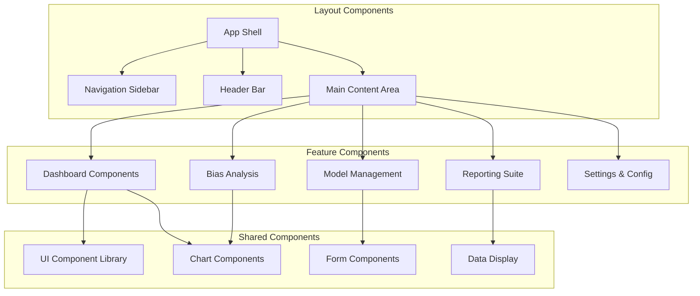
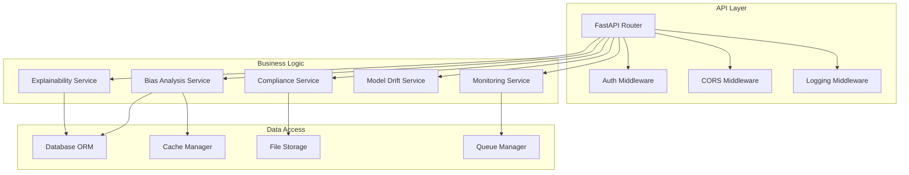

# Component Architecture

## 🧩 Component Breakdown

### Frontend Components Architecture



### Backend Service Components



## 🎨 Frontend Component Library

### Core UI Components

#### Button Component
```typescript
// packages/ui/button.tsx
interface ButtonProps {
  variant: 'primary' | 'secondary' | 'destructive' | 'outline' | 'ghost'
  size: 'sm' | 'md' | 'lg'
  disabled?: boolean
  loading?: boolean
  children: React.ReactNode
}

const Button = ({ variant, size, disabled, loading, children, ...props }) => {
  return (
    <button
      className={cn(
        buttonVariants({ variant, size }),
        disabled && 'opacity-50 cursor-not-allowed',
        loading && 'cursor-wait'
      )}
      disabled={disabled || loading}
      {...props}
    >
      {loading && <Spinner className="mr-2 h-4 w-4" />}
      {children}
    </button>
  )
}
```

#### Chart Components
```typescript
// packages/ui/charts/bias-chart.tsx
interface BiasChartProps {
  data: BiasMetric[]
  type: 'demographic' | 'statistical' | 'individual'
  interactive?: boolean
  onDataPointClick?: (metric: BiasMetric) => void
}

const BiasChart = ({ data, type, interactive, onDataPointClick }) => {
  const chartConfig = useMemo(() => {
    switch (type) {
      case 'demographic':
        return demographicChartConfig
      case 'statistical':
        return statisticalChartConfig
      case 'individual':
        return individualChartConfig
    }
  }, [type])

  return (
    <ResponsiveContainer width="100%" height={400}>
      <BarChart data={data} onClick={interactive ? onDataPointClick : undefined}>
        <XAxis dataKey="group" />
        <YAxis />
        <Tooltip content={<BiasTooltip />} />
        <Bar dataKey="value" fill={chartConfig.color} />
      </BarChart>
    </ResponsiveContainer>
  )
}
```

### Feature Components

#### Model Analysis Dashboard
```typescript
// apps/web/src/components/model-analysis-dashboard.tsx
interface ModelAnalysisDashboardProps {
  modelId: string
  analysisId?: string
}

const ModelAnalysisDashboard = ({ modelId, analysisId }) => {
  const { data: model, isLoading: modelLoading } = useModel(modelId)
  const { data: analysis, isLoading: analysisLoading } = useBiasAnalysis(analysisId)
  
  const [selectedMetric, setSelectedMetric] = useState<BiasMetric | null>(null)
  const [viewMode, setViewMode] = useState<'overview' | 'detailed'>('overview')

  if (modelLoading || analysisLoading) {
    return <LoadingSpinner />
  }

  return (
    <div className="space-y-6">
      <ModelHeader model={model} analysis={analysis} />
      
      <div className="grid grid-cols-1 lg:grid-cols-3 gap-6">
        <Card className="lg:col-span-2">
          <CardHeader>
            <CardTitle>Bias Analysis Results</CardTitle>
          </CardHeader>
          <CardContent>
            <BiasChart
              data={analysis.metrics}
              type="demographic"
              interactive
              onDataPointClick={setSelectedMetric}
            />
          </CardContent>
        </Card>
        
        <Card>
          <CardHeader>
            <CardTitle>Compliance Score</CardTitle>
          </CardHeader>
          <CardContent>
            <ComplianceScore score={analysis.complianceScore} />
            <RecommendationsList recommendations={analysis.recommendations} />
          </CardContent>
        </Card>
      </div>
      
      {selectedMetric && (
        <DetailedMetricView
          metric={selectedMetric}
          onClose={() => setSelectedMetric(null)}
        />
      )}
    </div>
  )
}
```

#### New Simulation Wizard
```typescript
// apps/web/src/components/new-simulation-wizard.tsx
interface NewSimulationWizardProps {
  onComplete: (simulation: Simulation) => void
  onCancel: () => void
}

const NewSimulationWizard = ({ onComplete, onCancel }) => {
  const [currentStep, setCurrentStep] = useState(0)
  const [formData, setFormData] = useState<Partial<SimulationConfig>>({})
  
  const steps = [
    { id: 'model', title: 'Model Upload', component: ModelUploadStep },
    { id: 'config', title: 'Configuration', component: ConfigurationStep },
    { id: 'datasets', title: 'Datasets', component: DatasetSelectionStep },
    { id: 'review', title: 'Review', component: ReviewStep }
  ]

  const handleStepComplete = (stepData: any) => {
    setFormData(prev => ({ ...prev, ...stepData }))
    
    if (currentStep < steps.length - 1) {
      setCurrentStep(prev => prev + 1)
    } else {
      // Final step - create simulation
      onComplete(formData as Simulation)
    }
  }

  const CurrentStepComponent = steps[currentStep].component

  return (
    <Dialog open onOpenChange={onCancel}>
      <DialogContent className="max-w-4xl max-h-[90vh] overflow-y-auto">
        <DialogHeader>
          <DialogTitle>Create New Simulation</DialogTitle>
          <WizardProgress steps={steps} currentStep={currentStep} />
        </DialogHeader>
        
        <CurrentStepComponent
          data={formData}
          onComplete={handleStepComplete}
          onBack={currentStep > 0 ? () => setCurrentStep(prev => prev - 1) : undefined}
        />
      </DialogContent>
    </Dialog>
  )
}
```

## 🔧 Backend Service Components

### ML Service Architecture

#### Bias Analysis Service
```python
# apps/ml-service/services/bias_analysis.py
from typing import List, Dict, Any
import numpy as np
import pandas as pd
from fairlearn.metrics import demographic_parity_difference
from aif360.datasets import StandardDataset
from aif360.metrics import BinaryLabelDatasetMetric

class BiasAnalysisService:
    def __init__(self):
        self.fairlearn_metrics = FairlearnMetrics()
        self.aif360_metrics = AIF360Metrics()
        self.custom_metrics = CustomMetrics()
    
    async def analyze_model(self, request: BiasAnalysisRequest) -> BiasAnalysisResponse:
        """
        Comprehensive bias analysis using multiple frameworks
        """
        # Load and prepare data
        dataset = await self._prepare_dataset(request.dataset)
        predictions = await self._get_predictions(request.model, dataset)
        
        # Run multiple bias assessments
        fairlearn_results = await self._run_fairlearn_analysis(
            dataset, predictions, request.protected_attributes
        )
        
        aif360_results = await self._run_aif360_analysis(
            dataset, predictions, request.protected_attributes
        )
        
        custom_results = await self._run_custom_analysis(
            dataset, predictions, request.protected_attributes
        )
        
        # Combine and score results
        combined_metrics = self._combine_metrics(
            fairlearn_results, aif360_results, custom_results
        )
        
        compliance_score = self._calculate_compliance_score(combined_metrics)
        recommendations = await self._generate_recommendations(combined_metrics)
        
        return BiasAnalysisResponse(
            metrics=combined_metrics,
            compliance_score=compliance_score,
            recommendations=recommendations,
            analysis_metadata=self._get_analysis_metadata()
        )
    
    async def _run_fairlearn_analysis(
        self, 
        dataset: pd.DataFrame, 
        predictions: np.ndarray,
        protected_attributes: List[str]
    ) -> Dict[str, Any]:
        """
        Run Fairlearn bias analysis
        """
        results = {}
        
        for attr in protected_attributes:
            # Demographic parity
            dp_diff = demographic_parity_difference(
                dataset['y_true'], 
                predictions, 
                sensitive_features=dataset[attr]
            )
            
            # Equalized odds
            eo_diff = equalized_odds_difference(
                dataset['y_true'], 
                predictions, 
                sensitive_features=dataset[attr]
            )
            
            results[attr] = {
                'demographic_parity_difference': dp_diff,
                'equalized_odds_difference': eo_diff,
                'fairness_score': self._calculate_fairness_score(dp_diff, eo_diff)
            }
        
        return results
```

#### Model Explainability Service
```python
# apps/ml-service/services/explainability.py
import shap
import lime
from lime.lime_explainer import LimeExplainer

class ExplainabilityService:
    def __init__(self):
        self.shap_explainer = None
        self.lime_explainer = None
    
    async def explain_prediction(
        self, 
        request: ExplanationRequest
    ) -> ExplanationResponse:
        """
        Generate model explanations using SHAP and LIME
        """
        model = await self._load_model(request.model_id)
        instance = request.instance
        
        # SHAP explanations
        shap_values = await self._generate_shap_explanation(model, instance)
        
        # LIME explanations
        lime_explanation = await self._generate_lime_explanation(model, instance)
        
        # Feature importance
        feature_importance = await self._calculate_feature_importance(
            model, instance, request.feature_names
        )
        
        return ExplanationResponse(
            shap_values=shap_values,
            lime_explanation=lime_explanation,
            feature_importance=feature_importance,
            global_explanations=await self._get_global_explanations(model)
        )
    
    async def _generate_shap_explanation(self, model, instance):
        """
        Generate SHAP explanations for the prediction
        """
        if self.shap_explainer is None:
            self.shap_explainer = shap.Explainer(model)
        
        shap_values = self.shap_explainer(instance)
        
        return {
            'values': shap_values.values.tolist(),
            'base_values': shap_values.base_values.tolist(),
            'data': shap_values.data.tolist(),
            'feature_names': list(instance.columns) if hasattr(instance, 'columns') else None
        }
    
    async def _generate_lime_explanation(self, model, instance):
        """
        Generate LIME explanations for the prediction
        """
        if self.lime_explainer is None:
            self.lime_explainer = LimeExplainer(
                mode='classification',
                feature_names=list(instance.columns) if hasattr(instance, 'columns') else None
            )
        
        explanation = self.lime_explainer.explain_instance(
            instance.values.flatten() if hasattr(instance, 'values') else instance,
            model.predict_proba
        )
        
        return {
            'local_explanation': explanation.as_list(),
            'score': explanation.score,
            'intercept': explanation.intercept[0] if explanation.intercept else None
        }
```

### Data Access Components

#### Database Service
```python
# apps/ml-service/services/database.py
from supabase import create_client, Client
from typing import List, Dict, Any, Optional
import json

class DatabaseService:
    def __init__(self, url: str, key: str):
        self.supabase: Client = create_client(url, key)
    
    async def create_analysis(self, analysis_data: Dict[str, Any]) -> str:
        """
        Create a new bias analysis record
        """
        result = self.supabase.table('bias_analyses').insert({
            'model_id': analysis_data['model_id'],
            'dataset_id': analysis_data['dataset_id'],
            'metrics': json.dumps(analysis_data['metrics']),
            'compliance_score': analysis_data['compliance_score'],
            'status': 'completed',
            'created_at': 'now()',
            'metadata': json.dumps(analysis_data.get('metadata', {}))
        }).execute()
        
        return result.data[0]['id']
    
    async def get_model_analyses(self, model_id: str) -> List[Dict[str, Any]]:
        """
        Get all analyses for a specific model
        """
        result = self.supabase.table('bias_analyses')\
            .select('*')\
            .eq('model_id', model_id)\
            .order('created_at', desc=True)\
            .execute()
        
        return result.data
    
    async def update_analysis_status(self, analysis_id: str, status: str):
        """
        Update the status of an analysis
        """
        self.supabase.table('bias_analyses')\
            .update({'status': status, 'updated_at': 'now()'})\
            .eq('id', analysis_id)\
            .execute()
```

## 🔄 Component Communication

### Frontend State Management

```typescript
// apps/web/src/lib/stores/analysis-store.ts
import { create } from 'zustand'
import { subscribeWithSelector } from 'zustand/middleware'

interface AnalysisState {
  currentAnalysis: BiasAnalysis | null
  analyses: BiasAnalysis[]
  isLoading: boolean
  selectedMetrics: string[]
  
  // Actions
  setCurrentAnalysis: (analysis: BiasAnalysis) => void
  addAnalysis: (analysis: BiasAnalysis) => void
  updateAnalysis: (id: string, updates: Partial<BiasAnalysis>) => void
  setSelectedMetrics: (metrics: string[]) => void
  
  // Async actions
  fetchAnalyses: (modelId: string) => Promise<void>
  createAnalysis: (request: BiasAnalysisRequest) => Promise<string>
}

export const useAnalysisStore = create<AnalysisState>()(
  subscribeWithSelector((set, get) => ({
    currentAnalysis: null,
    analyses: [],
    isLoading: false,
    selectedMetrics: [],
    
    setCurrentAnalysis: (analysis) => set({ currentAnalysis: analysis }),
    
    addAnalysis: (analysis) => set((state) => ({
      analyses: [analysis, ...state.analyses]
    })),
    
    updateAnalysis: (id, updates) => set((state) => ({
      analyses: state.analyses.map(a => 
        a.id === id ? { ...a, ...updates } : a
      ),
      currentAnalysis: state.currentAnalysis?.id === id 
        ? { ...state.currentAnalysis, ...updates }
        : state.currentAnalysis
    })),
    
    setSelectedMetrics: (metrics) => set({ selectedMetrics: metrics }),
    
    fetchAnalyses: async (modelId) => {
      set({ isLoading: true })
      try {
        const analyses = await aiGovernanceClient.getModelAnalyses(modelId)
        set({ analyses, isLoading: false })
      } catch (error) {
        console.error('Failed to fetch analyses:', error)
        set({ isLoading: false })
      }
    },
    
    createAnalysis: async (request) => {
      set({ isLoading: true })
      try {
        const analysisId = await aiGovernanceClient.createBiasAnalysis(request)
        
        // Start polling for results
        const pollForResults = async () => {
          const analysis = await aiGovernanceClient.getBiasAnalysis(analysisId)
          
          if (analysis.status === 'completed') {
            get().addAnalysis(analysis)
            set({ isLoading: false })
            return analysisId
          } else if (analysis.status === 'failed') {
            set({ isLoading: false })
            throw new Error('Analysis failed')
          } else {
            setTimeout(pollForResults, 2000)
          }
        }
        
        pollForResults()
        return analysisId
      } catch (error) {
        set({ isLoading: false })
        throw error
      }
    }
  }))
)
```

### Real-time Communication

```typescript
// apps/web/src/lib/realtime/analysis-subscription.ts
import { supabase } from '@/lib/supabase'
import { useAnalysisStore } from '@/lib/stores/analysis-store'

export const useAnalysisSubscription = (modelId: string) => {
  const updateAnalysis = useAnalysisStore(state => state.updateAnalysis)
  const addAnalysis = useAnalysisStore(state => state.addAnalysis)
  
  useEffect(() => {
    const subscription = supabase
      .channel('analysis-updates')
      .on(
        'postgres_changes',
        {
          event: '*',
          schema: 'public',
          table: 'bias_analyses',
          filter: `model_id=eq.${modelId}`
        },
        (payload) => {
          const { eventType, new: newRecord, old: oldRecord } = payload
          
          switch (eventType) {
            case 'INSERT':
              addAnalysis(newRecord as BiasAnalysis)
              break
            case 'UPDATE':
              updateAnalysis(newRecord.id, newRecord as Partial<BiasAnalysis>)
              break
            case 'DELETE':
              // Handle deletion if needed
              break
          }
        }
      )
      .subscribe()
    
    return () => {
      subscription.unsubscribe()
    }
  }, [modelId, updateAnalysis, addAnalysis])
}
```

## 🎯 Component Testing Strategy

### Frontend Component Testing

```typescript
// apps/web/src/components/__tests__/bias-chart.test.tsx
import { render, screen, fireEvent } from '@testing-library/react'
import { BiasChart } from '../bias-chart'

const mockData = [
  { group: 'Group A', value: 0.85, threshold: 0.8 },
  { group: 'Group B', value: 0.72, threshold: 0.8 },
  { group: 'Group C', value: 0.91, threshold: 0.8 }
]

describe('BiasChart', () => {
  it('renders chart with correct data', () => {
    render(<BiasChart data={mockData} type="demographic" />)
    
    expect(screen.getByText('Group A')).toBeInTheDocument()
    expect(screen.getByText('Group B')).toBeInTheDocument()
    expect(screen.getByText('Group C')).toBeInTheDocument()
  })
  
  it('calls onDataPointClick when interactive', () => {
    const onDataPointClick = jest.fn()
    render(
      <BiasChart 
        data={mockData} 
        type="demographic" 
        interactive 
        onDataPointClick={onDataPointClick}
      />
    )
    
    const groupABar = screen.getByTestId('bar-Group A')
    fireEvent.click(groupABar)
    
    expect(onDataPointClick).toHaveBeenCalledWith(mockData[0])
  })
  
  it('highlights values below threshold', () => {
    render(<BiasChart data={mockData} type="demographic" />)
    
    const groupBBar = screen.getByTestId('bar-Group B')
    expect(groupBBar).toHaveClass('fill-red-500') // Below threshold styling
  })
})
```

### Backend Service Testing

```python
# apps/ml-service/tests/test_bias_analysis.py
import pytest
import pandas as pd
import numpy as np
from services.bias_analysis import BiasAnalysisService
from models.requests import BiasAnalysisRequest

@pytest.fixture
def bias_service():
    return BiasAnalysisService()

@pytest.fixture
def sample_dataset():
    return pd.DataFrame({
        'feature1': np.random.normal(0, 1, 1000),
        'feature2': np.random.normal(0, 1, 1000),
        'protected_attr': np.random.choice(['A', 'B'], 1000),
        'y_true': np.random.choice([0, 1], 1000),
        'y_pred': np.random.choice([0, 1], 1000)
    })

@pytest.mark.asyncio
async def test_analyze_model(bias_service, sample_dataset):
    request = BiasAnalysisRequest(
        model_id='test-model',
        dataset=sample_dataset,
        protected_attributes=['protected_attr']
    )
    
    result = await bias_service.analyze_model(request)
    
    assert result.metrics is not None
    assert 'protected_attr' in result.metrics
    assert result.compliance_score >= 0
    assert result.compliance_score <= 100
    assert len(result.recommendations) > 0

@pytest.mark.asyncio
async def test_fairlearn_analysis(bias_service, sample_dataset):
    results = await bias_service._run_fairlearn_analysis(
        sample_dataset, 
        sample_dataset['y_pred'].values,
        ['protected_attr']
    )
    
    assert 'protected_attr' in results
    assert 'demographic_parity_difference' in results['protected_attr']
    assert 'equalized_odds_difference' in results['protected_attr']
    assert 'fairness_score' in results['protected_attr']
```

This comprehensive component architecture provides a solid foundation for building scalable, maintainable, and testable AI governance applications.
