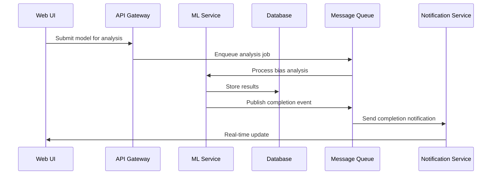
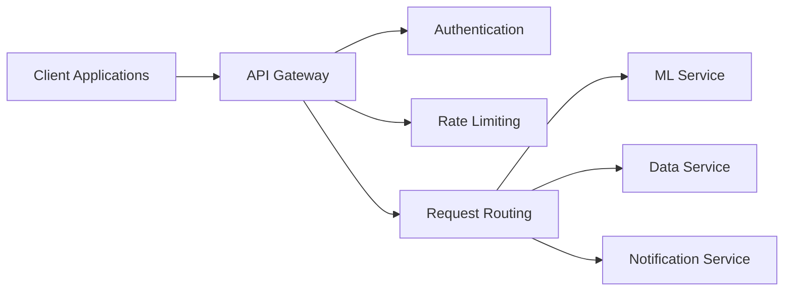
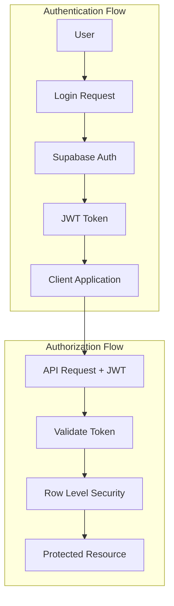
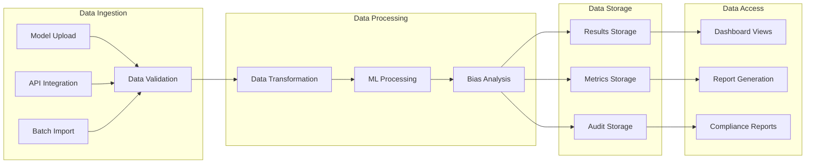
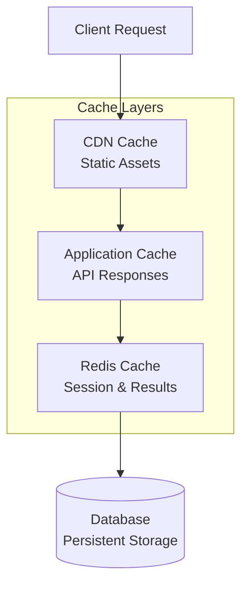
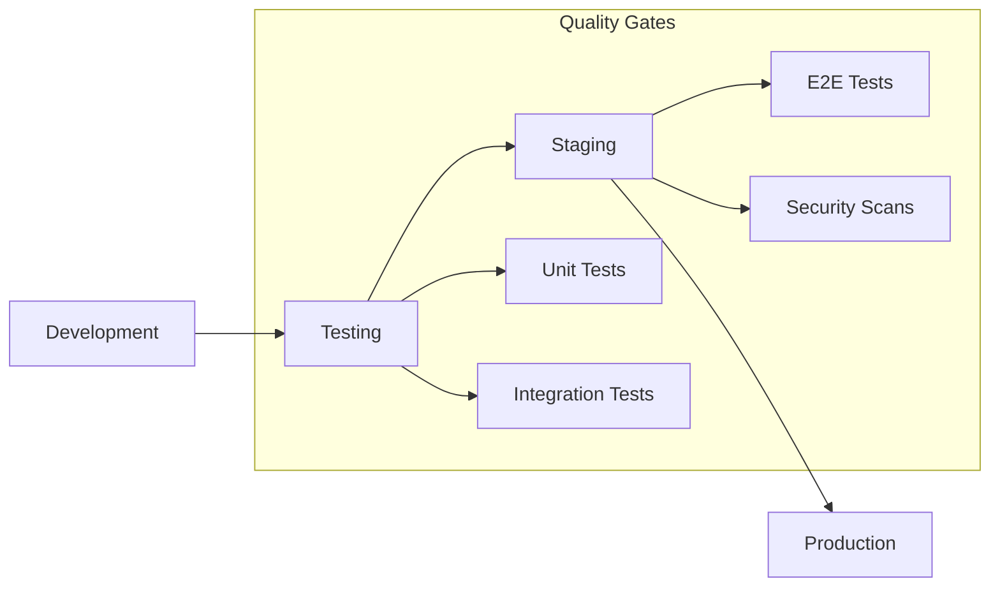
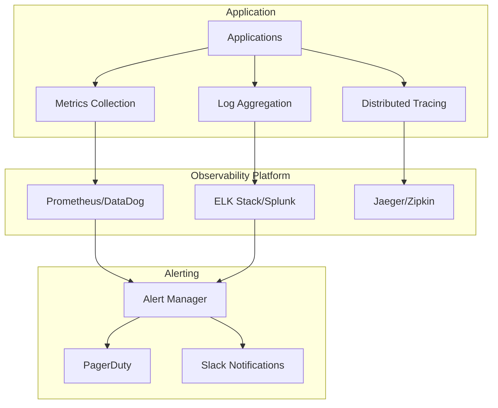

# System Architecture Overview

## 🏗️ High-Level Architecture

Fairmind v2 follows a modern, cloud-native microservices architecture designed for scalability, reliability, and maintainability.

```mermaid
graph TB
    %% Client Layer
    subgraph "Client Layer"
        WEB[Web Dashboard<br/>Next.js]
        API_CLIENT[API Clients<br/>SDKs]
        MOBILE[Mobile App<br/>React Native]
    end

    %% API Gateway & Load Balancer
    subgraph "Edge Layer"
        LB[Load Balancer<br/>Cloudflare/AWS]
        CDN[CDN<br/>Static Assets]
        WAF[Web Application Firewall]
    end

    %% Application Layer
    subgraph "Application Layer"
        WEB_APP[Web Application<br/>Next.js SSR/SSG]
        API_GW[API Gateway<br/>Authentication & Routing]
    end

    %% Service Layer
    subgraph "Core Services"
        ML_SERVICE[ML Service<br/>FastAPI + Python]
        AUTH_SERVICE[Authentication<br/>Supabase Auth]
        DATA_SERVICE[Data Service<br/>Supabase Client]
        NOTIFICATION[Notification Service<br/>Real-time Alerts]
    end

    %% Data Layer
    subgraph "Data Layer"
        PRIMARY_DB[(Primary Database<br/>Supabase PostgreSQL)]
        CACHE[(Redis Cache<br/>Session & ML Results)]
        BLOB[File Storage<br/>Supabase Storage]
        QUEUE[Message Queue<br/>Background Jobs)]
    end

    %% External Services
    subgraph "External Services"
        MONITORING[Monitoring<br/>DataDog/New Relic]
        LOGGING[Logging<br/>Structured Logs]
        ALERTS[Alert Manager<br/>PagerDuty/Slack]
    end

    %% Connections
    WEB --> LB
    API_CLIENT --> LB
    MOBILE --> LB
    
    LB --> WAF
    WAF --> WEB_APP
    WAF --> API_GW
    
    WEB_APP --> AUTH_SERVICE
    WEB_APP --> DATA_SERVICE
    API_GW --> ML_SERVICE
    API_GW --> AUTH_SERVICE
    
    ML_SERVICE --> PRIMARY_DB
    ML_SERVICE --> CACHE
    AUTH_SERVICE --> PRIMARY_DB
    DATA_SERVICE --> PRIMARY_DB
    DATA_SERVICE --> BLOB
    
    ML_SERVICE --> QUEUE
    NOTIFICATION --> QUEUE
    
    ML_SERVICE --> MONITORING
    WEB_APP --> MONITORING
    MONITORING --> ALERTS
```

## 🎯 Architecture Principles

### 1. **Separation of Concerns**
- **Frontend**: User interface and experience
- **Backend API**: Business logic and data access
- **ML Service**: Machine learning algorithms and processing
- **Database**: Data persistence and management

### 2. **Scalability First**
- Horizontal scaling capabilities
- Microservices architecture
- Stateless service design
- Caching strategies

### 3. **Security by Design**
- Authentication and authorization at every layer
- Data encryption in transit and at rest
- Input validation and sanitization
- Audit logging for all operations

### 4. **Observability**
- Comprehensive logging and monitoring
- Distributed tracing
- Performance metrics
- Health checks and alerting

## 🔧 Technology Stack

### Frontend Layer
```yaml
Framework: Next.js 15 (React 19)
Language: TypeScript
Styling: Tailwind CSS + shadcn/ui
State Management: React Query + Zustand
Charts: Recharts + D3.js
Authentication: Supabase Auth
Real-time: WebSockets + Server-Sent Events
```

### Backend Layer
```yaml
ML Service: FastAPI (Python)
Authentication: Supabase Auth
Database: Supabase PostgreSQL
Storage: Supabase Storage
Real-time: Supabase Realtime
Caching: Redis
Queue: Bull/Agenda.js
```

### ML & AI Stack
```yaml
Core ML: scikit-learn, NumPy, Pandas
Explainability: SHAP, LIME
Fairness: Fairlearn, AIF360
Deep Learning: PyTorch (if needed)
Data Processing: Apache Airflow
Model Serving: FastAPI + Uvicorn
```

### Infrastructure
```yaml
Cloud Provider: AWS/GCP/Azure
Container Runtime: Docker
Orchestration: Kubernetes (optional)
CI/CD: GitHub Actions
Monitoring: DataDog/New Relic
Logging: Structured JSON logs
```

## 🏛️ Architectural Patterns

### 1. **Event-Driven Architecture**


### 2. **CQRS (Command Query Responsibility Segregation)**
- **Commands**: Model analysis requests, configuration updates
- **Queries**: Dashboard data, report generation, historical analysis
- **Separate read/write models** for optimal performance

### 3. **API Gateway Pattern**


## 🔐 Security Architecture

### Authentication & Authorization


### Data Protection
- **Encryption at Rest**: AES-256 encryption for database
- **Encryption in Transit**: TLS 1.3 for all communications
- **Data Anonymization**: PII scrubbing for ML processing
- **Access Controls**: Role-based permissions (RBAC)

### Compliance & Audit
- **SOC 2 Type II** compliance readiness
- **GDPR** compliance with data portability
- **HIPAA** compliance for healthcare use cases
- **Audit Logs**: Immutable audit trail for all operations

## 📊 Data Architecture

### Data Flow Patterns


### Data Consistency
- **ACID Transactions** for critical operations
- **Eventual Consistency** for analytics data
- **Event Sourcing** for audit trails
- **Data Versioning** for model assessments

## 🚀 Performance Architecture

### Caching Strategy


### Scaling Strategy
- **Horizontal Scaling**: Auto-scaling groups for services
- **Vertical Scaling**: Resource optimization for ML workloads
- **Database Scaling**: Read replicas and connection pooling
- **CDN Distribution**: Global content delivery

### Performance Metrics
- **Response Time**: <200ms for API calls
- **Throughput**: 1000+ concurrent users
- **Availability**: 99.9% uptime SLA
- **ML Processing**: <5 seconds for bias analysis

## 🔄 Development & Deployment

### Development Workflow


### Deployment Strategy
- **Blue-Green Deployment** for zero-downtime releases
- **Feature Flags** for gradual rollouts
- **Database Migrations** with rollback capability
- **Health Checks** and automated rollback

## 🔍 Monitoring & Observability

### Observability Stack


### Key Metrics
- **Business Metrics**: Bias detection accuracy, compliance scores
- **Technical Metrics**: Response times, error rates, throughput
- **Infrastructure Metrics**: CPU, memory, disk, network
- **User Metrics**: Active users, feature adoption, satisfaction

## 🎯 Future Architecture Considerations

### Short-term Enhancements
- **GraphQL API** for flexible data querying
- **Microservices** decomposition for better scalability
- **Event Streaming** with Apache Kafka
- **Container Orchestration** with Kubernetes

### Long-term Vision
- **Multi-cloud Deployment** for global availability
- **Edge Computing** for low-latency processing
- **AI/ML Pipeline Automation** with MLOps
- **Advanced Analytics** with real-time streaming
