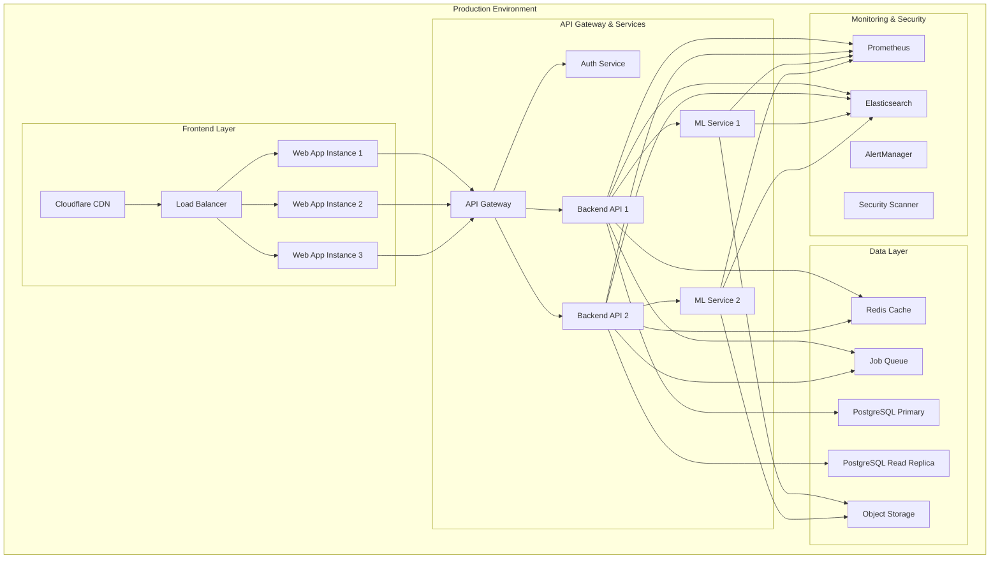

# Deployment & Infrastructure Guide

## 🚀 Production Deployment Architecture

### Infrastructure Overview



## 🐳 Docker Configuration

### Multi-Stage Dockerfile

```dockerfile
# Dockerfile.web
# Build stage
FROM node:20-alpine AS builder

WORKDIR /app

# Copy package files
COPY package.json package-lock.json ./
COPY apps/web/package.json ./apps/web/
COPY packages/ui/package.json ./packages/ui/

# Install dependencies
RUN npm ci --only=production

# Copy source code
COPY . .

# Build the application
RUN npm run build:web

# Runtime stage
FROM node:20-alpine AS runner

WORKDIR /app

# Create non-root user
RUN addgroup --system --gid 1001 nodejs
RUN adduser --system --uid 1001 nextjs

# Copy built application
COPY --from=builder --chown=nextjs:nodejs /app/apps/web/.next ./apps/web/.next
COPY --from=builder --chown=nextjs:nodejs /app/apps/web/public ./apps/web/public
COPY --from=builder --chown=nextjs:nodejs /app/package.json ./
COPY --from=builder --chown=nextjs:nodejs /app/apps/web/package.json ./apps/web/

# Install production dependencies
RUN npm ci --only=production

USER nextjs

EXPOSE 3000

ENV PORT=3000
ENV NODE_ENV=production

CMD ["npm", "run", "start:web"]
```

```dockerfile
# Dockerfile.api
FROM node:20-alpine AS builder

WORKDIR /app

# Copy package files
COPY package.json package-lock.json ./
COPY backend/api/package.json ./backend/api/

# Install dependencies
RUN npm ci --only=production

# Copy source code
COPY backend/api ./backend/api

# Build the application
RUN npm run build:api

# Runtime stage
FROM node:20-alpine AS runner

WORKDIR /app

# Create non-root user
RUN addgroup --system --gid 1001 nodejs
RUN adduser --system --uid 1001 apiuser

# Copy built application
COPY --from=builder --chown=apiuser:nodejs /app/backend/api/dist ./dist
COPY --from=builder --chown=apiuser:nodejs /app/backend/api/package.json ./

# Install production dependencies
RUN npm ci --only=production

USER apiuser

EXPOSE 8000

ENV PORT=8000
ENV NODE_ENV=production

CMD ["node", "dist/main.js"]
```

```dockerfile
# Dockerfile.ml
FROM python:3.11-slim AS builder

WORKDIR /app

# Install system dependencies
RUN apt-get update && apt-get install -y \
    gcc \
    g++ \
    make \
    && rm -rf /var/lib/apt/lists/*

# Copy requirements
COPY apps/ml-service/requirements.txt .

# Install Python dependencies
RUN pip install --no-cache-dir -r requirements.txt

# Runtime stage
FROM python:3.11-slim AS runner

WORKDIR /app

# Create non-root user
RUN groupadd --gid 1001 mluser && \
    useradd --uid 1001 --gid mluser --shell /bin/bash --create-home mluser

# Copy installed packages from builder
COPY --from=builder /usr/local/lib/python3.11/site-packages /usr/local/lib/python3.11/site-packages
COPY --from=builder /usr/local/bin /usr/local/bin

# Copy application code
COPY --chown=mluser:mluser apps/ml-service ./

USER mluser

EXPOSE 8001

ENV PYTHONPATH=/app
ENV PORT=8001

CMD ["uvicorn", "main:app", "--host", "0.0.0.0", "--port", "8001"]
```

### Docker Compose

```yaml
# docker-compose.yml
version: '3.8'

services:
  # Frontend
  web:
    build:
      context: .
      dockerfile: Dockerfile.web
    container_name: fairmind-web
    ports:
      - "3000:3000"
    environment:
      - NODE_ENV=production
      - NEXT_PUBLIC_API_URL=http://api:8000
      - NEXT_PUBLIC_SUPABASE_URL=${SUPABASE_URL}
      - NEXT_PUBLIC_SUPABASE_ANON_KEY=${SUPABASE_ANON_KEY}
    depends_on:
      - api
    networks:
      - fairmind-network
    restart: unless-stopped
    healthcheck:
      test: ["CMD", "curl", "-f", "http://localhost:3000/api/health"]
      interval: 30s
      timeout: 10s
      retries: 3

  # Backend API
  api:
    build:
      context: .
      dockerfile: Dockerfile.api
    container_name: fairmind-api
    ports:
      - "8000:8000"
    environment:
      - NODE_ENV=production
      - DATABASE_URL=${DATABASE_URL}
      - SUPABASE_URL=${SUPABASE_URL}
      - SUPABASE_SERVICE_ROLE_KEY=${SUPABASE_SERVICE_ROLE_KEY}
      - REDIS_URL=${REDIS_URL}
      - ML_SERVICE_URL=http://ml-service:8001
    depends_on:
      - redis
      - ml-service
    networks:
      - fairmind-network
    restart: unless-stopped
    healthcheck:
      test: ["CMD", "curl", "-f", "http://localhost:8000/health"]
      interval: 30s
      timeout: 10s
      retries: 3

  # ML Service
  ml-service:
    build:
      context: .
      dockerfile: Dockerfile.ml
    container_name: fairmind-ml
    ports:
      - "8001:8001"
    environment:
      - PYTHONPATH=/app
      - MODEL_STORAGE_PATH=/app/models
      - CACHE_SIZE=1000
    volumes:
      - ml-models:/app/models
      - ml-cache:/app/cache
    networks:
      - fairmind-network
    restart: unless-stopped
    healthcheck:
      test: ["CMD", "curl", "-f", "http://localhost:8001/health"]
      interval: 30s
      timeout: 10s
      retries: 3

  # Redis Cache
  redis:
    image: redis:7-alpine
    container_name: fairmind-redis
    ports:
      - "6379:6379"
    volumes:
      - redis-data:/data
    networks:
      - fairmind-network
    restart: unless-stopped
    healthcheck:
      test: ["CMD", "redis-cli", "ping"]
      interval: 30s
      timeout: 10s
      retries: 3

  # Nginx Reverse Proxy
  nginx:
    image: nginx:alpine
    container_name: fairmind-nginx
    ports:
      - "80:80"
      - "443:443"
    volumes:
      - ./nginx.conf:/etc/nginx/nginx.conf:ro
      - ./ssl:/etc/nginx/ssl:ro
    depends_on:
      - web
      - api
    networks:
      - fairmind-network
    restart: unless-stopped

  # Monitoring
  prometheus:
    image: prom/prometheus:latest
    container_name: fairmind-prometheus
    ports:
      - "9090:9090"
    volumes:
      - ./monitoring/prometheus.yml:/etc/prometheus/prometheus.yml:ro
      - prometheus-data:/prometheus
    networks:
      - fairmind-network
    restart: unless-stopped

  grafana:
    image: grafana/grafana:latest
    container_name: fairmind-grafana
    ports:
      - "3001:3000"
    environment:
      - GF_SECURITY_ADMIN_PASSWORD=${GRAFANA_PASSWORD}
    volumes:
      - grafana-data:/var/lib/grafana
      - ./monitoring/grafana/dashboards:/etc/grafana/provisioning/dashboards:ro
      - ./monitoring/grafana/datasources:/etc/grafana/provisioning/datasources:ro
    depends_on:
      - prometheus
    networks:
      - fairmind-network
    restart: unless-stopped

volumes:
  ml-models:
  ml-cache:
  redis-data:
  prometheus-data:
  grafana-data:

networks:
  fairmind-network:
    driver: bridge
```

## ☸️ Kubernetes Deployment

### Namespace & ConfigMap

```yaml
# k8s/namespace.yaml
apiVersion: v1
kind: Namespace
metadata:
  name: fairmind
  labels:
    name: fairmind
    environment: production

---
apiVersion: v1
kind: ConfigMap
metadata:
  name: fairmind-config
  namespace: fairmind
data:
  NODE_ENV: "production"
  REDIS_HOST: "redis-service"
  REDIS_PORT: "6379"
  ML_SERVICE_URL: "http://ml-service:8001"
  API_URL: "http://api-service:8000"
```

### Secrets

```yaml
# k8s/secrets.yaml
apiVersion: v1
kind: Secret
metadata:
  name: fairmind-secrets
  namespace: fairmind
type: Opaque
data:
  DATABASE_URL: <base64-encoded>
  SUPABASE_URL: <base64-encoded>
  SUPABASE_SERVICE_ROLE_KEY: <base64-encoded>
  SUPABASE_ANON_KEY: <base64-encoded>
  JWT_SECRET: <base64-encoded>
  GRAFANA_PASSWORD: <base64-encoded>
```

### Web Application Deployment

```yaml
# k8s/web-deployment.yaml
apiVersion: apps/v1
kind: Deployment
metadata:
  name: web-deployment
  namespace: fairmind
  labels:
    app: fairmind-web
spec:
  replicas: 3
  selector:
    matchLabels:
      app: fairmind-web
  template:
    metadata:
      labels:
        app: fairmind-web
    spec:
      containers:
      - name: web
        image: fairmind/web:latest
        ports:
        - containerPort: 3000
        env:
        - name: NODE_ENV
          valueFrom:
            configMapKeyRef:
              name: fairmind-config
              key: NODE_ENV
        - name: NEXT_PUBLIC_API_URL
          valueFrom:
            configMapKeyRef:
              name: fairmind-config
              key: API_URL
        - name: NEXT_PUBLIC_SUPABASE_URL
          valueFrom:
            secretKeyRef:
              name: fairmind-secrets
              key: SUPABASE_URL
        - name: NEXT_PUBLIC_SUPABASE_ANON_KEY
          valueFrom:
            secretKeyRef:
              name: fairmind-secrets
              key: SUPABASE_ANON_KEY
        resources:
          requests:
            memory: "256Mi"
            cpu: "250m"
          limits:
            memory: "512Mi"
            cpu: "500m"
        livenessProbe:
          httpGet:
            path: /api/health
            port: 3000
          initialDelaySeconds: 30
          periodSeconds: 10
        readinessProbe:
          httpGet:
            path: /api/health
            port: 3000
          initialDelaySeconds: 5
          periodSeconds: 5

---
apiVersion: v1
kind: Service
metadata:
  name: web-service
  namespace: fairmind
spec:
  selector:
    app: fairmind-web
  ports:
  - port: 3000
    targetPort: 3000
  type: ClusterIP
```

### API Deployment

```yaml
# k8s/api-deployment.yaml
apiVersion: apps/v1
kind: Deployment
metadata:
  name: api-deployment
  namespace: fairmind
  labels:
    app: fairmind-api
spec:
  replicas: 3
  selector:
    matchLabels:
      app: fairmind-api
  template:
    metadata:
      labels:
        app: fairmind-api
    spec:
      containers:
      - name: api
        image: fairmind/api:latest
        ports:
        - containerPort: 8000
        env:
        - name: NODE_ENV
          valueFrom:
            configMapKeyRef:
              name: fairmind-config
              key: NODE_ENV
        - name: DATABASE_URL
          valueFrom:
            secretKeyRef:
              name: fairmind-secrets
              key: DATABASE_URL
        - name: REDIS_URL
          value: "redis://$(REDIS_HOST):$(REDIS_PORT)"
        - name: REDIS_HOST
          valueFrom:
            configMapKeyRef:
              name: fairmind-config
              key: REDIS_HOST
        - name: REDIS_PORT
          valueFrom:
            configMapKeyRef:
              name: fairmind-config
              key: REDIS_PORT
        - name: ML_SERVICE_URL
          valueFrom:
            configMapKeyRef:
              name: fairmind-config
              key: ML_SERVICE_URL
        resources:
          requests:
            memory: "512Mi"
            cpu: "500m"
          limits:
            memory: "1Gi"
            cpu: "1000m"
        livenessProbe:
          httpGet:
            path: /health
            port: 8000
          initialDelaySeconds: 30
          periodSeconds: 10
        readinessProbe:
          httpGet:
            path: /health
            port: 8000
          initialDelaySeconds: 10
          periodSeconds: 5

---
apiVersion: v1
kind: Service
metadata:
  name: api-service
  namespace: fairmind
spec:
  selector:
    app: fairmind-api
  ports:
  - port: 8000
    targetPort: 8000
  type: ClusterIP
```

### ML Service Deployment

```yaml
# k8s/ml-deployment.yaml
apiVersion: apps/v1
kind: Deployment
metadata:
  name: ml-deployment
  namespace: fairmind
  labels:
    app: fairmind-ml
spec:
  replicas: 2
  selector:
    matchLabels:
      app: fairmind-ml
  template:
    metadata:
      labels:
        app: fairmind-ml
    spec:
      containers:
      - name: ml-service
        image: fairmind/ml:latest
        ports:
        - containerPort: 8001
        env:
        - name: PYTHONPATH
          value: "/app"
        - name: MODEL_STORAGE_PATH
          value: "/app/models"
        - name: CACHE_SIZE
          value: "1000"
        volumeMounts:
        - name: model-storage
          mountPath: /app/models
        - name: cache-storage
          mountPath: /app/cache
        resources:
          requests:
            memory: "1Gi"
            cpu: "1000m"
          limits:
            memory: "4Gi"
            cpu: "2000m"
        livenessProbe:
          httpGet:
            path: /health
            port: 8001
          initialDelaySeconds: 60
          periodSeconds: 15
        readinessProbe:
          httpGet:
            path: /health
            port: 8001
          initialDelaySeconds: 30
          periodSeconds: 10
      volumes:
      - name: model-storage
        persistentVolumeClaim:
          claimName: ml-models-pvc
      - name: cache-storage
        emptyDir:
          sizeLimit: 1Gi

---
apiVersion: v1
kind: Service
metadata:
  name: ml-service
  namespace: fairmind
spec:
  selector:
    app: fairmind-ml
  ports:
  - port: 8001
    targetPort: 8001
  type: ClusterIP

---
apiVersion: v1
kind: PersistentVolumeClaim
metadata:
  name: ml-models-pvc
  namespace: fairmind
spec:
  accessModes:
    - ReadWriteOnce
  resources:
    requests:
      storage: 20Gi
  storageClassName: fast-ssd
```

### Ingress Configuration

```yaml
# k8s/ingress.yaml
apiVersion: networking.k8s.io/v1
kind: Ingress
metadata:
  name: fairmind-ingress
  namespace: fairmind
  annotations:
    kubernetes.io/ingress.class: nginx
    cert-manager.io/cluster-issuer: letsencrypt-prod
    nginx.ingress.kubernetes.io/ssl-redirect: "true"
    nginx.ingress.kubernetes.io/use-regex: "true"
    nginx.ingress.kubernetes.io/proxy-body-size: "50m"
    nginx.ingress.kubernetes.io/rate-limit: "100"
    nginx.ingress.kubernetes.io/rate-limit-window: "1m"
spec:
  tls:
  - hosts:
    - fairmind.ai
    - api.fairmind.ai
    secretName: fairmind-tls
  rules:
  - host: fairmind.ai
    http:
      paths:
      - path: /
        pathType: Prefix
        backend:
          service:
            name: web-service
            port:
              number: 3000
  - host: api.fairmind.ai
    http:
      paths:
      - path: /
        pathType: Prefix
        backend:
          service:
            name: api-service
            port:
              number: 8000
```

## 🔄 CI/CD Pipeline

### GitHub Actions

```yaml
# .github/workflows/deploy.yml
name: Deploy to Production

on:
  push:
    branches: [main]
  workflow_dispatch:

env:
  REGISTRY: ghcr.io
  IMAGE_NAME: fairmind

jobs:
  test:
    runs-on: ubuntu-latest
    steps:
    - uses: actions/checkout@v4
    
    - name: Setup Node.js
      uses: actions/setup-node@v4
      with:
        node-version: '20'
        cache: 'npm'
    
    - name: Install dependencies
      run: npm ci
    
    - name: Run tests
      run: npm run test:ci
    
    - name: Run lint
      run: npm run lint
    
    - name: Run type check
      run: npm run type-check

  build-and-push:
    needs: test
    runs-on: ubuntu-latest
    strategy:
      matrix:
        service: [web, api, ml]
    steps:
    - uses: actions/checkout@v4
    
    - name: Log in to Container Registry
      uses: docker/login-action@v3
      with:
        registry: ${{ env.REGISTRY }}
        username: ${{ github.actor }}
        password: ${{ secrets.GITHUB_TOKEN }}
    
    - name: Extract metadata
      id: meta
      uses: docker/metadata-action@v5
      with:
        images: ${{ env.REGISTRY }}/${{ env.IMAGE_NAME }}/${{ matrix.service }}
        tags: |
          type=ref,event=branch
          type=ref,event=pr
          type=sha,prefix={{branch}}-
          type=raw,value=latest,enable={{is_default_branch}}
    
    - name: Build and push Docker image
      uses: docker/build-push-action@v5
      with:
        context: .
        file: ./Dockerfile.${{ matrix.service }}
        push: true
        tags: ${{ steps.meta.outputs.tags }}
        labels: ${{ steps.meta.outputs.labels }}
        cache-from: type=gha
        cache-to: type=gha,mode=max

  deploy:
    needs: build-and-push
    runs-on: ubuntu-latest
    environment: production
    steps:
    - uses: actions/checkout@v4
    
    - name: Setup kubectl
      uses: azure/setup-kubectl@v3
      with:
        version: 'v1.28.0'
    
    - name: Setup Kubernetes config
      run: |
        mkdir -p ~/.kube
        echo "${{ secrets.KUBE_CONFIG }}" | base64 -d > ~/.kube/config
    
    - name: Deploy to Kubernetes
      run: |
        kubectl apply -f k8s/namespace.yaml
        kubectl apply -f k8s/secrets.yaml
        kubectl apply -f k8s/
        kubectl rollout restart deployment/web-deployment -n fairmind
        kubectl rollout restart deployment/api-deployment -n fairmind
        kubectl rollout restart deployment/ml-deployment -n fairmind
        kubectl rollout status deployment/web-deployment -n fairmind
        kubectl rollout status deployment/api-deployment -n fairmind
        kubectl rollout status deployment/ml-deployment -n fairmind
    
    - name: Verify deployment
      run: |
        kubectl get pods -n fairmind
        kubectl get services -n fairmind
        kubectl get ingress -n fairmind

  security-scan:
    needs: build-and-push
    runs-on: ubuntu-latest
    steps:
    - name: Run Trivy vulnerability scanner
      uses: aquasecurity/trivy-action@master
      with:
        image-ref: ${{ env.REGISTRY }}/${{ env.IMAGE_NAME }}/web:latest
        format: 'sarif'
        output: 'trivy-results.sarif'
    
    - name: Upload Trivy scan results to GitHub Security tab
      uses: github/codeql-action/upload-sarif@v2
      with:
        sarif_file: 'trivy-results.sarif'
```

## 🔧 Infrastructure as Code

### Terraform Configuration

```hcl
# terraform/main.tf
terraform {
  required_version = ">= 1.0"
  required_providers {
    aws = {
      source  = "hashicorp/aws"
      version = "~> 5.0"
    }
    kubernetes = {
      source  = "hashicorp/kubernetes"
      version = "~> 2.20"
    }
  }
  
  backend "s3" {
    bucket = "fairmind-terraform-state"
    key    = "production/terraform.tfstate"
    region = "us-west-2"
  }
}

provider "aws" {
  region = var.aws_region
}

# EKS Cluster
module "eks" {
  source = "terraform-aws-modules/eks/aws"
  
  cluster_name    = var.cluster_name
  cluster_version = "1.28"
  
  vpc_id     = module.vpc.vpc_id
  subnet_ids = module.vpc.private_subnets
  
  node_groups = {
    main = {
      desired_capacity = 3
      max_capacity     = 10
      min_capacity     = 3
      
      instance_types = ["t3.large"]
      
      labels = {
        Environment = "production"
        Application = "fairmind"
      }
      
      taints = []
    }
    
    ml = {
      desired_capacity = 2
      max_capacity     = 5
      min_capacity     = 2
      
      instance_types = ["c5.2xlarge"]
      
      labels = {
        Environment = "production"
        Application = "fairmind"
        Workload    = "ml"
      }
      
      taints = [
        {
          key    = "workload"
          value  = "ml"
          effect = "NO_SCHEDULE"
        }
      ]
    }
  }
}

# VPC
module "vpc" {
  source = "terraform-aws-modules/vpc/aws"
  
  name = "${var.cluster_name}-vpc"
  cidr = "10.0.0.0/16"
  
  azs             = ["${var.aws_region}a", "${var.aws_region}b", "${var.aws_region}c"]
  private_subnets = ["10.0.1.0/24", "10.0.2.0/24", "10.0.3.0/24"]
  public_subnets  = ["10.0.101.0/24", "10.0.102.0/24", "10.0.103.0/24"]
  
  enable_nat_gateway = true
  enable_vpn_gateway = true
  
  tags = {
    Environment = "production"
    Application = "fairmind"
  }
}

# RDS Instance
resource "aws_db_instance" "main" {
  identifier = "${var.cluster_name}-postgres"
  
  engine         = "postgres"
  engine_version = "15.3"
  instance_class = "db.r6g.xlarge"
  
  allocated_storage     = 100
  max_allocated_storage = 1000
  storage_encrypted     = true
  
  db_name  = "fairmind"
  username = var.db_username
  password = var.db_password
  
  vpc_security_group_ids = [aws_security_group.rds.id]
  db_subnet_group_name   = aws_db_subnet_group.main.name
  
  backup_retention_period = 30
  backup_window          = "03:00-04:00"
  maintenance_window     = "sun:04:00-sun:05:00"
  
  deletion_protection = true
  skip_final_snapshot = false
  
  tags = {
    Environment = "production"
    Application = "fairmind"
  }
}

# ElastiCache Redis
resource "aws_elasticache_subnet_group" "main" {
  name       = "${var.cluster_name}-cache-subnet"
  subnet_ids = module.vpc.private_subnets
}

resource "aws_elasticache_replication_group" "main" {
  replication_group_id       = "${var.cluster_name}-redis"
  description                = "Redis cluster for Fairmind"
  
  port               = 6379
  parameter_group    = "default.redis7"
  node_type          = "cache.r6g.large"
  num_cache_clusters = 3
  
  subnet_group_name  = aws_elasticache_subnet_group.main.name
  security_group_ids = [aws_security_group.redis.id]
  
  at_rest_encryption_enabled = true
  transit_encryption_enabled = true
  
  tags = {
    Environment = "production"
    Application = "fairmind"
  }
}

# Security Groups
resource "aws_security_group" "rds" {
  name_prefix = "${var.cluster_name}-rds-"
  vpc_id      = module.vpc.vpc_id
  
  ingress {
    from_port   = 5432
    to_port     = 5432
    protocol    = "tcp"
    cidr_blocks = [module.vpc.vpc_cidr_block]
  }
  
  egress {
    from_port   = 0
    to_port     = 0
    protocol    = "-1"
    cidr_blocks = ["0.0.0.0/0"]
  }
  
  tags = {
    Name = "${var.cluster_name}-rds-sg"
  }
}

resource "aws_security_group" "redis" {
  name_prefix = "${var.cluster_name}-redis-"
  vpc_id      = module.vpc.vpc_id
  
  ingress {
    from_port   = 6379
    to_port     = 6379
    protocol    = "tcp"
    cidr_blocks = [module.vpc.vpc_cidr_block]
  }
  
  egress {
    from_port   = 0
    to_port     = 0
    protocol    = "-1"
    cidr_blocks = ["0.0.0.0/0"]
  }
  
  tags = {
    Name = "${var.cluster_name}-redis-sg"
  }
}

# Variables
variable "aws_region" {
  description = "AWS region"
  type        = string
  default     = "us-west-2"
}

variable "cluster_name" {
  description = "EKS cluster name"
  type        = string
  default     = "fairmind-prod"
}

variable "db_username" {
  description = "Database username"
  type        = string
  sensitive   = true
}

variable "db_password" {
  description = "Database password"
  type        = string
  sensitive   = true
}

# Outputs
output "cluster_endpoint" {
  description = "EKS cluster endpoint"
  value       = module.eks.cluster_endpoint
}

output "cluster_security_group_id" {
  description = "Security group ID attached to the EKS cluster"
  value       = module.eks.cluster_security_group_id
}

output "rds_endpoint" {
  description = "RDS instance endpoint"
  value       = aws_db_instance.main.endpoint
}

output "redis_endpoint" {
  description = "Redis cluster endpoint"
  value       = aws_elasticache_replication_group.main.primary_endpoint_address
}
```

## 📊 Monitoring & Alerting

### Prometheus Configuration

```yaml
# monitoring/prometheus.yml
global:
  scrape_interval: 15s
  evaluation_interval: 15s

rule_files:
  - "rules/*.yml"

alerting:
  alertmanagers:
    - static_configs:
        - targets:
          - alertmanager:9093

scrape_configs:
  - job_name: 'fairmind-web'
    static_configs:
      - targets: ['web-service:3000']
    metrics_path: '/api/metrics'

  - job_name: 'fairmind-api'
    static_configs:
      - targets: ['api-service:8000']
    metrics_path: '/metrics'

  - job_name: 'fairmind-ml'
    static_configs:
      - targets: ['ml-service:8001']
    metrics_path: '/metrics'

  - job_name: 'redis'
    static_configs:
      - targets: ['redis:6379']

  - job_name: 'kubernetes-pods'
    kubernetes_sd_configs:
      - role: pod
    relabel_configs:
      - source_labels: [__meta_kubernetes_pod_annotation_prometheus_io_scrape]
        action: keep
        regex: true
```

### Alert Rules

```yaml
# monitoring/rules/alerts.yml
groups:
  - name: fairmind-alerts
    rules:
      - alert: HighErrorRate
        expr: rate(http_requests_total{status=~"5.."}[5m]) > 0.1
        for: 5m
        labels:
          severity: critical
        annotations:
          summary: "High error rate detected"
          description: "Error rate is {{ $value }} for {{ $labels.instance }}"

      - alert: HighLatency
        expr: histogram_quantile(0.95, rate(http_request_duration_seconds_bucket[5m])) > 1
        for: 10m
        labels:
          severity: warning
        annotations:
          summary: "High latency detected"
          description: "95th percentile latency is {{ $value }}s for {{ $labels.instance }}"

      - alert: BiasAnalysisBacklog
        expr: bias_analysis_queue_size > 100
        for: 15m
        labels:
          severity: warning
        annotations:
          summary: "Bias analysis queue backlog"
          description: "Queue size is {{ $value }} analyses"

      - alert: ComplianceViolation
        expr: increase(compliance_violations_total[1h]) > 0
        for: 0m
        labels:
          severity: critical
        annotations:
          summary: "New compliance violations detected"
          description: "{{ $value }} violations in the last hour"
```

This comprehensive deployment guide provides all the necessary configuration files and infrastructure code to deploy Fairmind v2 in production environments with proper monitoring, security, and scalability considerations.
