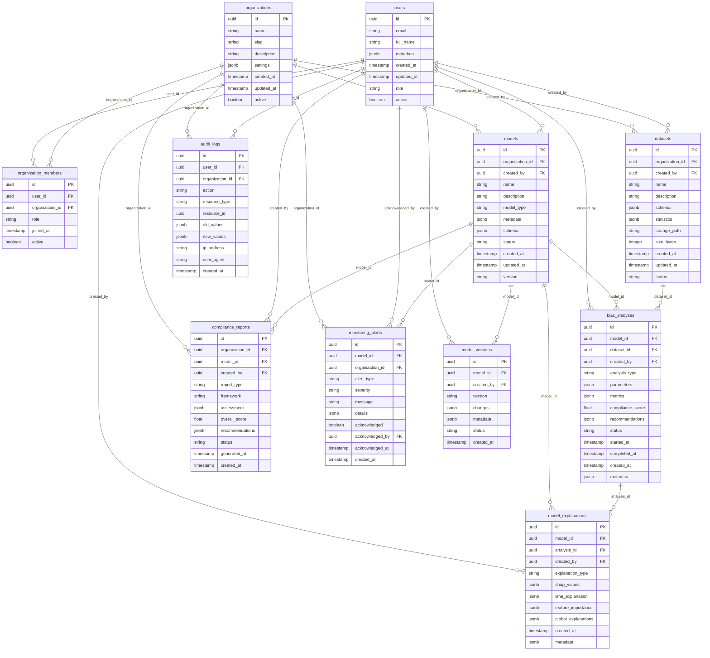

# Database Schema & Design

## 🗄️ Database Overview

Fairmind v2 uses **Supabase PostgreSQL** as the primary database, leveraging its built-in authentication, real-time subscriptions, and Row Level Security (RLS) for a secure, scalable data layer.

### Database Architecture Principles

- **Security First**: Row Level Security (RLS) for multi-tenant data isolation
- **Performance Optimized**: Proper indexing and query optimization
- **Audit Ready**: Complete audit trails for compliance
- **Scalable**: Designed for horizontal scaling with read replicas
- **Real-time**: Live updates via Supabase real-time subscriptions

## 📊 Entity Relationship Diagram



## 📋 Detailed Schema Definitions

### Core Tables

#### users
```sql
CREATE TABLE users (
    id UUID PRIMARY KEY DEFAULT gen_random_uuid(),
    email TEXT UNIQUE NOT NULL,
    full_name TEXT NOT NULL,
    metadata JSONB DEFAULT '{}',
    created_at TIMESTAMP WITH TIME ZONE DEFAULT NOW(),
    updated_at TIMESTAMP WITH TIME ZONE DEFAULT NOW(),
    role TEXT DEFAULT 'user' CHECK (role IN ('admin', 'user', 'viewer')),
    active BOOLEAN DEFAULT true
);

-- Indexes
CREATE INDEX idx_users_email ON users(email);
CREATE INDEX idx_users_role ON users(role);
CREATE INDEX idx_users_active ON users(active);

-- Row Level Security
ALTER TABLE users ENABLE ROW LEVEL SECURITY;

CREATE POLICY "Users can view own data" ON users
    FOR SELECT USING (auth.uid() = id);

CREATE POLICY "Users can update own data" ON users
    FOR UPDATE USING (auth.uid() = id);
```

#### organizations
```sql
CREATE TABLE organizations (
    id UUID PRIMARY KEY DEFAULT gen_random_uuid(),
    name TEXT NOT NULL,
    slug TEXT UNIQUE NOT NULL,
    description TEXT,
    settings JSONB DEFAULT '{}',
    created_at TIMESTAMP WITH TIME ZONE DEFAULT NOW(),
    updated_at TIMESTAMP WITH TIME ZONE DEFAULT NOW(),
    active BOOLEAN DEFAULT true
);

-- Indexes
CREATE INDEX idx_organizations_slug ON organizations(slug);
CREATE INDEX idx_organizations_active ON organizations(active);

-- Row Level Security
ALTER TABLE organizations ENABLE ROW LEVEL SECURITY;

CREATE POLICY "Organization members can view" ON organizations
    FOR SELECT USING (
        id IN (
            SELECT organization_id 
            FROM organization_members 
            WHERE user_id = auth.uid() AND active = true
        )
    );
```

#### models
```sql
CREATE TABLE models (
    id UUID PRIMARY KEY DEFAULT gen_random_uuid(),
    organization_id UUID NOT NULL REFERENCES organizations(id) ON DELETE CASCADE,
    created_by UUID NOT NULL REFERENCES users(id),
    name TEXT NOT NULL,
    description TEXT,
    model_type TEXT NOT NULL CHECK (
        model_type IN ('classification', 'regression', 'clustering', 'recommendation')
    ),
    metadata JSONB DEFAULT '{}',
    schema JSONB NOT NULL,
    status TEXT DEFAULT 'draft' CHECK (
        status IN ('draft', 'active', 'archived', 'deprecated')
    ),
    created_at TIMESTAMP WITH TIME ZONE DEFAULT NOW(),
    updated_at TIMESTAMP WITH TIME ZONE DEFAULT NOW(),
    version TEXT DEFAULT '1.0.0'
);

-- Indexes
CREATE INDEX idx_models_organization ON models(organization_id);
CREATE INDEX idx_models_created_by ON models(created_by);
CREATE INDEX idx_models_status ON models(status);
CREATE INDEX idx_models_type ON models(model_type);
CREATE INDEX idx_models_name_search ON models USING gin(to_tsvector('english', name || ' ' || coalesce(description, '')));

-- Row Level Security
ALTER TABLE models ENABLE ROW LEVEL SECURITY;

CREATE POLICY "Organization members can view models" ON models
    FOR SELECT USING (
        organization_id IN (
            SELECT organization_id 
            FROM organization_members 
            WHERE user_id = auth.uid() AND active = true
        )
    );

CREATE POLICY "Organization members can create models" ON models
    FOR INSERT WITH CHECK (
        organization_id IN (
            SELECT organization_id 
            FROM organization_members 
            WHERE user_id = auth.uid() AND active = true
        )
    );
```

#### bias_analyses
```sql
CREATE TABLE bias_analyses (
    id UUID PRIMARY KEY DEFAULT gen_random_uuid(),
    model_id UUID NOT NULL REFERENCES models(id) ON DELETE CASCADE,
    dataset_id UUID NOT NULL REFERENCES datasets(id) ON DELETE CASCADE,
    created_by UUID NOT NULL REFERENCES users(id),
    analysis_type TEXT NOT NULL CHECK (
        analysis_type IN ('demographic_parity', 'equalized_odds', 'individual_fairness', 'comprehensive')
    ),
    parameters JSONB NOT NULL DEFAULT '{}',
    metrics JSONB DEFAULT '{}',
    compliance_score DECIMAL(5,2) CHECK (compliance_score BETWEEN 0 AND 100),
    recommendations JSONB DEFAULT '[]',
    status TEXT DEFAULT 'queued' CHECK (
        status IN ('queued', 'running', 'completed', 'failed', 'cancelled')
    ),
    started_at TIMESTAMP WITH TIME ZONE,
    completed_at TIMESTAMP WITH TIME ZONE,
    created_at TIMESTAMP WITH TIME ZONE DEFAULT NOW(),
    metadata JSONB DEFAULT '{}'
);

-- Indexes
CREATE INDEX idx_bias_analyses_model ON bias_analyses(model_id);
CREATE INDEX idx_bias_analyses_dataset ON bias_analyses(dataset_id);
CREATE INDEX idx_bias_analyses_status ON bias_analyses(status);
CREATE INDEX idx_bias_analyses_created_by ON bias_analyses(created_by);
CREATE INDEX idx_bias_analyses_type ON bias_analyses(analysis_type);
CREATE INDEX idx_bias_analyses_score ON bias_analyses(compliance_score);
CREATE INDEX idx_bias_analyses_created_at ON bias_analyses(created_at DESC);

-- Row Level Security
ALTER TABLE bias_analyses ENABLE ROW LEVEL SECURITY;

CREATE POLICY "Users can view analyses for their org models" ON bias_analyses
    FOR SELECT USING (
        model_id IN (
            SELECT m.id FROM models m
            JOIN organization_members om ON m.organization_id = om.organization_id
            WHERE om.user_id = auth.uid() AND om.active = true
        )
    );
```

#### model_explanations
```sql
CREATE TABLE model_explanations (
    id UUID PRIMARY KEY DEFAULT gen_random_uuid(),
    model_id UUID NOT NULL REFERENCES models(id) ON DELETE CASCADE,
    analysis_id UUID REFERENCES bias_analyses(id) ON DELETE CASCADE,
    created_by UUID NOT NULL REFERENCES users(id),
    explanation_type TEXT NOT NULL CHECK (
        explanation_type IN ('shap', 'lime', 'permutation', 'global')
    ),
    shap_values JSONB DEFAULT '{}',
    lime_explanation JSONB DEFAULT '{}',
    feature_importance JSONB DEFAULT '{}',
    global_explanations JSONB DEFAULT '{}',
    created_at TIMESTAMP WITH TIME ZONE DEFAULT NOW(),
    metadata JSONB DEFAULT '{}'
);

-- Indexes
CREATE INDEX idx_explanations_model ON model_explanations(model_id);
CREATE INDEX idx_explanations_analysis ON model_explanations(analysis_id);
CREATE INDEX idx_explanations_type ON model_explanations(explanation_type);
CREATE INDEX idx_explanations_created_at ON model_explanations(created_at DESC);
```

### Audit & Monitoring Tables

#### audit_logs
```sql
CREATE TABLE audit_logs (
    id UUID PRIMARY KEY DEFAULT gen_random_uuid(),
    user_id UUID REFERENCES users(id),
    organization_id UUID REFERENCES organizations(id),
    action TEXT NOT NULL,
    resource_type TEXT NOT NULL,
    resource_id UUID,
    old_values JSONB DEFAULT '{}',
    new_values JSONB DEFAULT '{}',
    ip_address INET,
    user_agent TEXT,
    created_at TIMESTAMP WITH TIME ZONE DEFAULT NOW()
);

-- Indexes
CREATE INDEX idx_audit_logs_user ON audit_logs(user_id);
CREATE INDEX idx_audit_logs_org ON audit_logs(organization_id);
CREATE INDEX idx_audit_logs_action ON audit_logs(action);
CREATE INDEX idx_audit_logs_resource ON audit_logs(resource_type, resource_id);
CREATE INDEX idx_audit_logs_created_at ON audit_logs(created_at DESC);

-- Partitioning for performance (monthly partitions)
SELECT create_hypertable('audit_logs', 'created_at', chunk_time_interval => INTERVAL '1 month');
```

#### monitoring_alerts
```sql
CREATE TABLE monitoring_alerts (
    id UUID PRIMARY KEY DEFAULT gen_random_uuid(),
    model_id UUID REFERENCES models(id) ON DELETE CASCADE,
    organization_id UUID NOT NULL REFERENCES organizations(id) ON DELETE CASCADE,
    alert_type TEXT NOT NULL CHECK (
        alert_type IN ('bias_drift', 'performance_degradation', 'data_quality', 'compliance_violation')
    ),
    severity TEXT NOT NULL CHECK (
        severity IN ('low', 'medium', 'high', 'critical')
    ),
    message TEXT NOT NULL,
    details JSONB DEFAULT '{}',
    acknowledged BOOLEAN DEFAULT false,
    acknowledged_by UUID REFERENCES users(id),
    acknowledged_at TIMESTAMP WITH TIME ZONE,
    created_at TIMESTAMP WITH TIME ZONE DEFAULT NOW()
);

-- Indexes
CREATE INDEX idx_alerts_model ON monitoring_alerts(model_id);
CREATE INDEX idx_alerts_org ON monitoring_alerts(organization_id);
CREATE INDEX idx_alerts_type ON monitoring_alerts(alert_type);
CREATE INDEX idx_alerts_severity ON monitoring_alerts(severity);
CREATE INDEX idx_alerts_acknowledged ON monitoring_alerts(acknowledged);
CREATE INDEX idx_alerts_created_at ON monitoring_alerts(created_at DESC);
```

## 🔍 Advanced Database Features

### Custom Functions

#### Compliance Score Calculation
```sql
CREATE OR REPLACE FUNCTION calculate_compliance_score(
    bias_metrics JSONB,
    thresholds JSONB DEFAULT '{"demographic_parity": 0.1, "equalized_odds": 0.1}'::jsonb
) RETURNS DECIMAL(5,2) AS $$
DECLARE
    score DECIMAL(5,2) := 100.0;
    metric_name TEXT;
    metric_value DECIMAL;
    threshold_value DECIMAL;
BEGIN
    FOR metric_name IN SELECT jsonb_object_keys(bias_metrics)
    LOOP
        metric_value := (bias_metrics ->> metric_name)::DECIMAL;
        threshold_value := COALESCE((thresholds ->> metric_name)::DECIMAL, 0.1);
        
        IF metric_value > threshold_value THEN
            score := score - (metric_value - threshold_value) * 100;
        END IF;
    END LOOP;
    
    RETURN GREATEST(score, 0.0);
END;
$$ LANGUAGE plpgsql;
```

#### Audit Trigger Function
```sql
CREATE OR REPLACE FUNCTION audit_trigger_function() 
RETURNS TRIGGER AS $$
BEGIN
    INSERT INTO audit_logs (
        user_id,
        organization_id,
        action,
        resource_type,
        resource_id,
        old_values,
        new_values,
        ip_address
    ) VALUES (
        auth.uid(),
        COALESCE(NEW.organization_id, OLD.organization_id),
        TG_OP,
        TG_TABLE_NAME,
        COALESCE(NEW.id, OLD.id),
        CASE WHEN TG_OP = 'DELETE' THEN to_jsonb(OLD) ELSE '{}' END,
        CASE WHEN TG_OP = 'INSERT' OR TG_OP = 'UPDATE' THEN to_jsonb(NEW) ELSE '{}' END,
        inet_client_addr()
    );
    RETURN COALESCE(NEW, OLD);
END;
$$ LANGUAGE plpgsql;

-- Apply audit triggers to key tables
CREATE TRIGGER models_audit_trigger 
    AFTER INSERT OR UPDATE OR DELETE ON models
    FOR EACH ROW EXECUTE FUNCTION audit_trigger_function();

CREATE TRIGGER bias_analyses_audit_trigger 
    AFTER INSERT OR UPDATE OR DELETE ON bias_analyses
    FOR EACH ROW EXECUTE FUNCTION audit_trigger_function();
```

### Views for Common Queries

#### Model Performance Summary
```sql
CREATE VIEW model_performance_summary AS
SELECT 
    m.id,
    m.name,
    m.organization_id,
    COUNT(ba.id) as total_analyses,
    AVG(ba.compliance_score) as avg_compliance_score,
    MAX(ba.compliance_score) as best_compliance_score,
    MIN(ba.compliance_score) as worst_compliance_score,
    COUNT(CASE WHEN ba.status = 'completed' THEN 1 END) as completed_analyses,
    COUNT(CASE WHEN ba.status = 'failed' THEN 1 END) as failed_analyses,
    MAX(ba.created_at) as last_analysis_date
FROM models m
LEFT JOIN bias_analyses ba ON m.id = ba.model_id
GROUP BY m.id, m.name, m.organization_id;
```

#### Organization Dashboard Data
```sql
CREATE VIEW organization_dashboard AS
SELECT 
    o.id as organization_id,
    o.name as organization_name,
    COUNT(DISTINCT m.id) as total_models,
    COUNT(DISTINCT ba.id) as total_analyses,
    AVG(ba.compliance_score) as avg_compliance_score,
    COUNT(CASE WHEN ma.severity = 'critical' AND NOT ma.acknowledged THEN 1 END) as critical_alerts,
    COUNT(CASE WHEN ma.severity = 'high' AND NOT ma.acknowledged THEN 1 END) as high_alerts,
    COUNT(DISTINCT om.user_id) as total_members
FROM organizations o
LEFT JOIN models m ON o.id = m.organization_id
LEFT JOIN bias_analyses ba ON m.id = ba.model_id AND ba.status = 'completed'
LEFT JOIN monitoring_alerts ma ON o.id = ma.organization_id
LEFT JOIN organization_members om ON o.id = om.organization_id AND om.active = true
GROUP BY o.id, o.name;
```

## 🚀 Performance Optimization

### Indexing Strategy

```sql
-- Composite indexes for common query patterns
CREATE INDEX idx_bias_analyses_model_status_created 
ON bias_analyses(model_id, status, created_at DESC);

CREATE INDEX idx_models_org_status_type 
ON models(organization_id, status, model_type);

CREATE INDEX idx_alerts_org_acknowledged_severity 
ON monitoring_alerts(organization_id, acknowledged, severity);

-- Partial indexes for specific use cases
CREATE INDEX idx_active_models 
ON models(organization_id, created_at DESC) 
WHERE status = 'active';

CREATE INDEX idx_unacknowledged_alerts 
ON monitoring_alerts(organization_id, severity, created_at DESC) 
WHERE NOT acknowledged;

-- GIN indexes for JSONB search
CREATE INDEX idx_models_metadata_gin 
ON models USING gin(metadata);

CREATE INDEX idx_bias_metrics_gin 
ON bias_analyses USING gin(metrics);
```

### Query Optimization Examples

```sql
-- Optimized query for model dashboard
SELECT 
    m.id,
    m.name,
    m.status,
    latest_analysis.compliance_score,
    latest_analysis.created_at as last_analysis_date,
    alert_counts.critical_alerts,
    alert_counts.total_alerts
FROM models m
LEFT JOIN LATERAL (
    SELECT compliance_score, created_at
    FROM bias_analyses ba
    WHERE ba.model_id = m.id AND ba.status = 'completed'
    ORDER BY ba.created_at DESC
    LIMIT 1
) latest_analysis ON true
LEFT JOIN LATERAL (
    SELECT 
        COUNT(*) as total_alerts,
        COUNT(CASE WHEN severity = 'critical' THEN 1 END) as critical_alerts
    FROM monitoring_alerts ma
    WHERE ma.model_id = m.id AND NOT ma.acknowledged
) alert_counts ON true
WHERE m.organization_id = $1 AND m.status = 'active'
ORDER BY m.name;
```

## 🔒 Security & Row Level Security

### RLS Policies

```sql
-- Models: Organization-based access
CREATE POLICY "models_org_access" ON models
FOR ALL USING (
    organization_id IN (
        SELECT om.organization_id 
        FROM organization_members om 
        WHERE om.user_id = auth.uid() AND om.active = true
    )
);

-- Bias Analyses: Model-based access through organization
CREATE POLICY "analyses_access" ON bias_analyses
FOR ALL USING (
    model_id IN (
        SELECT m.id FROM models m
        JOIN organization_members om ON m.organization_id = om.organization_id
        WHERE om.user_id = auth.uid() AND om.active = true
    )
);

-- Audit Logs: Users can view their own actions, admins can view all
CREATE POLICY "audit_logs_access" ON audit_logs
FOR SELECT USING (
    user_id = auth.uid() OR 
    EXISTS (
        SELECT 1 FROM users u 
        WHERE u.id = auth.uid() AND u.role = 'admin'
    )
);
```

## 📈 Database Monitoring & Maintenance

### Performance Monitoring Views

```sql
-- Slow query monitoring
CREATE VIEW slow_queries AS
SELECT 
    query,
    calls,
    total_time,
    mean_time,
    max_time,
    stddev_time
FROM pg_stat_statements
WHERE mean_time > 100  -- queries taking more than 100ms on average
ORDER BY mean_time DESC;

-- Table size monitoring
CREATE VIEW table_sizes AS
SELECT 
    schemaname,
    tablename,
    attname,
    n_distinct,
    correlation,
    pg_size_pretty(pg_total_relation_size(c.oid)) as size
FROM pg_stats s
JOIN pg_class c ON c.relname = s.tablename
ORDER BY pg_total_relation_size(c.oid) DESC;
```

### Maintenance Procedures

```sql
-- Automated cleanup procedure
CREATE OR REPLACE FUNCTION cleanup_old_data() 
RETURNS void AS $$
BEGIN
    -- Archive old audit logs (older than 2 years)
    DELETE FROM audit_logs 
    WHERE created_at < NOW() - INTERVAL '2 years';
    
    -- Clean up failed analyses older than 30 days
    DELETE FROM bias_analyses 
    WHERE status = 'failed' AND created_at < NOW() - INTERVAL '30 days';
    
    -- Update table statistics
    ANALYZE;
END;
$$ LANGUAGE plpgsql;

-- Schedule cleanup job (requires pg_cron extension)
SELECT cron.schedule('cleanup-old-data', '0 2 * * 0', 'SELECT cleanup_old_data();');
```

This comprehensive database design provides a solid foundation for the Fairmind v2 platform with proper security, performance optimization, and maintainability features.
